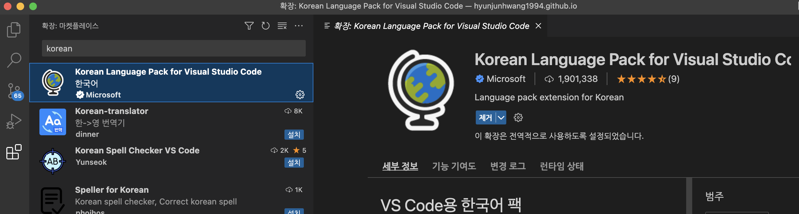
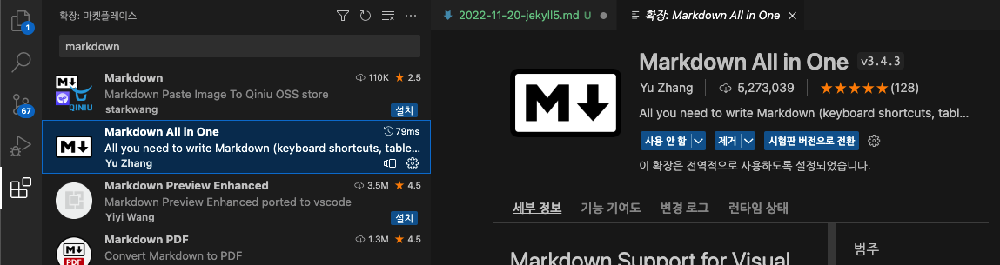
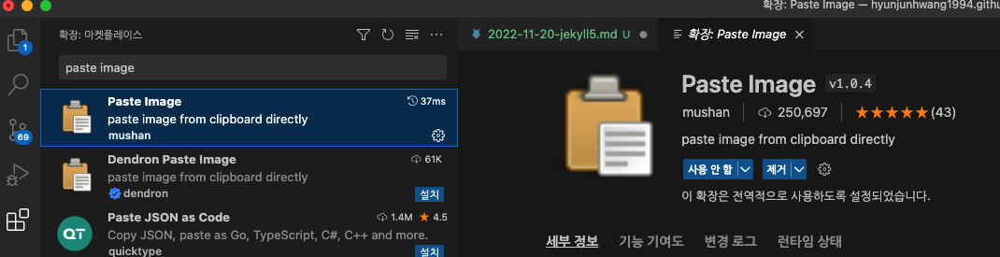
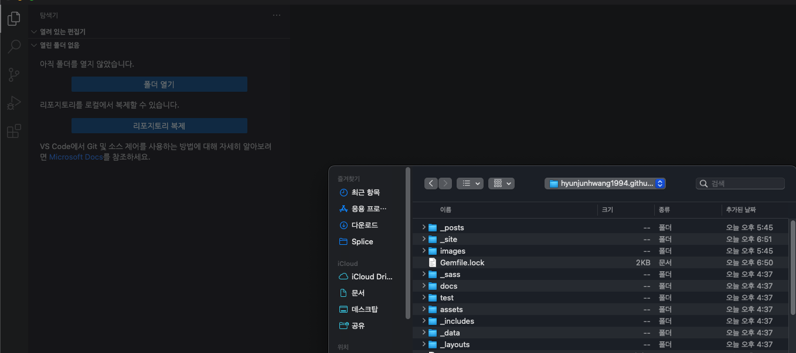
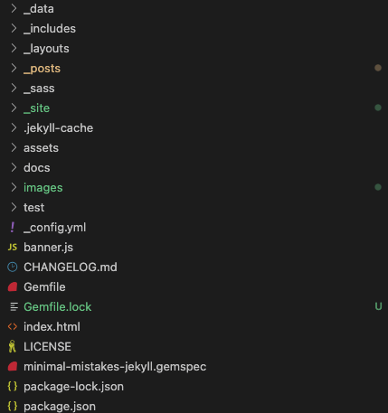
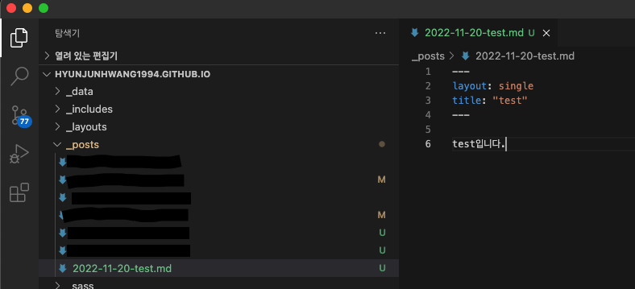
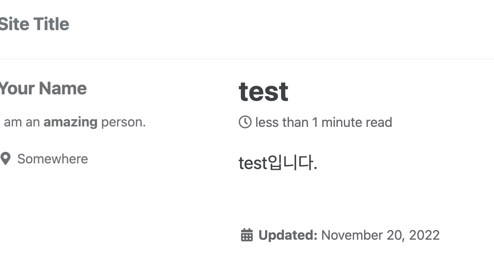

          개발 환경 
          - 2021, 맥북 프로 M1 Pro 14인치 모델  
          - Ventura 13.1 베타(22C5050e) 버전
          

 

># 포스팅을 편리하게 하기 위한 VS code 설치

## 설치

아래의 링크에서 설치해 주세요.  
[VS Code](https://code.visualstudio.com/)

## 익스텐션 설치
확장팩을 설치하는 과정입니다.  
왼쪽 맨 아래 확장 메뉴에서 해당 팩들을 설치해 주세요.  
(저는 설치되어 있어서 제거로 나오고 있네요.)

한글 패치

마크다운 언어 사용 시 올인원 툴

마크다운 사진 편하게 붙일 수 있게 해주는 앱

 

># 블로그 관리.

## Post 편하게 관리하기.

폴더 열기 -> 자신의 블로그 레파지토리 선택

이런 식으로 나오면 성공입니다.  
{: .align-center}

그러면 이제 _posts에 글을 작성하고 vs code 편집기 에서 저장을 하면

우리 로컬 서버에 바로 적용되는 걸 볼 수 있다.

(실제 블로그에 적용하려면 깃헙 데스크탑으로 Commit, Push 진행)

## 마지막으로..
여기까지 이제, 로컬 서버 생성, Vs code, Github desktop 설치 등으로,  
블로그의 포스팅 관리 및 실시간 확인을 빠르고 편하게 할 수 있는 방법을 알아보았습니다.  

이 이후 블로그 포스팅이나 관리는 먼저 실제 로컬 컴퓨터에서 수정한 후에  
깃헙데스크탑으로 Commit, Push 하는 게 좋아요!
