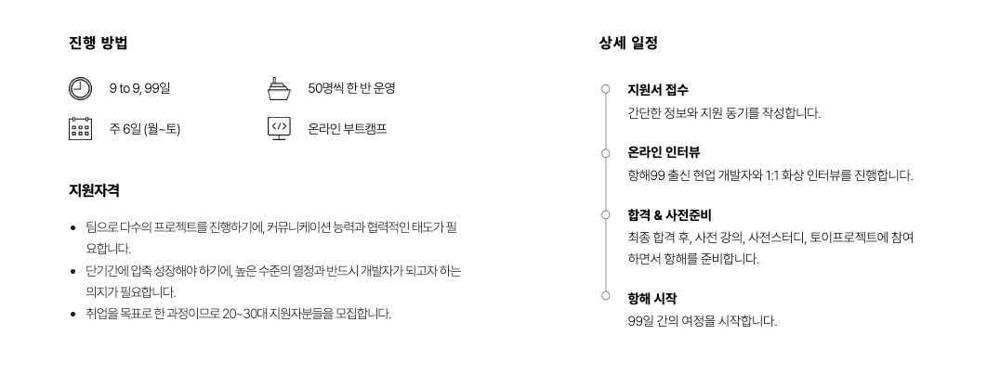
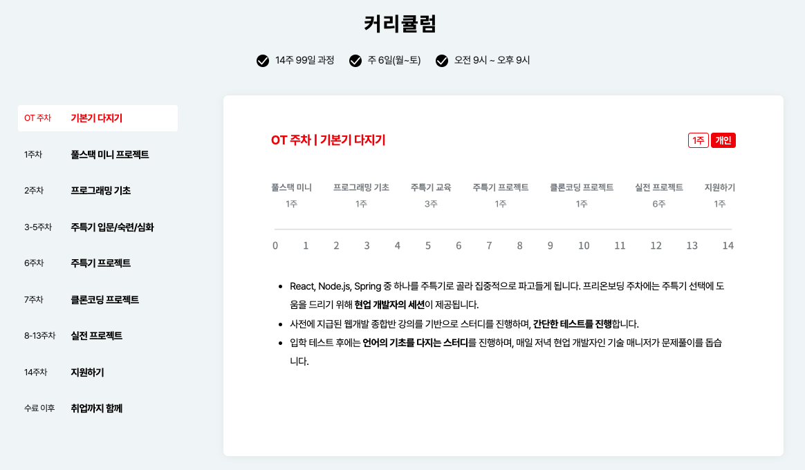
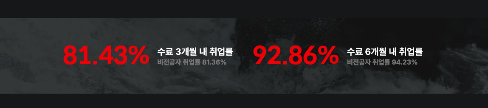
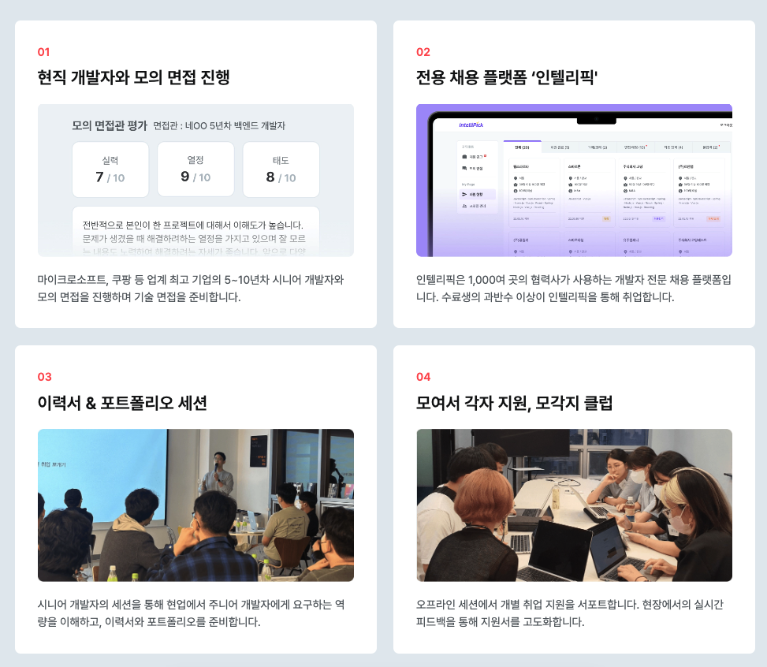
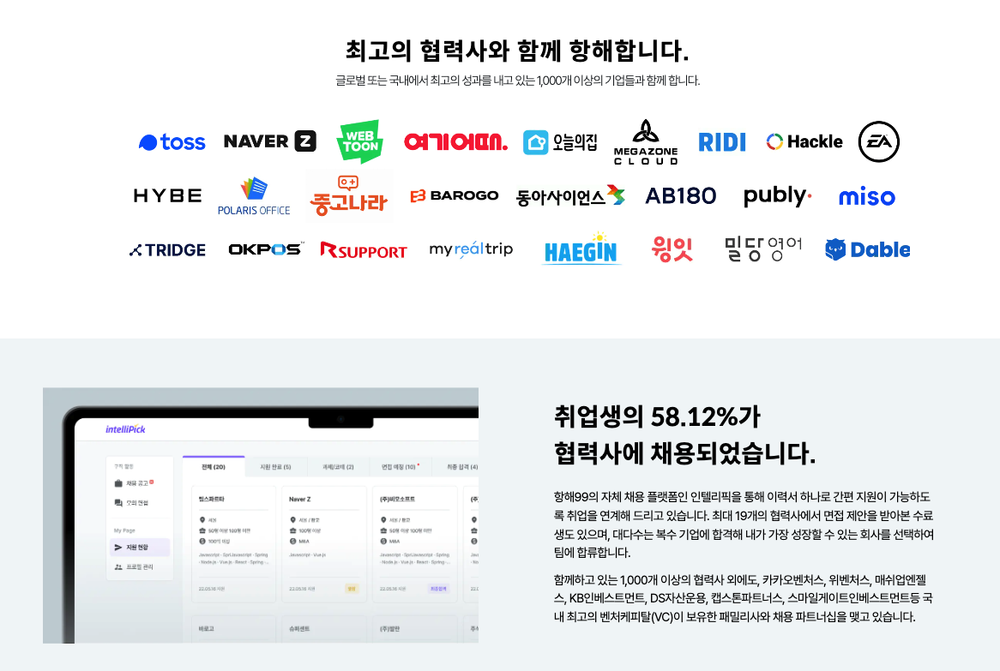
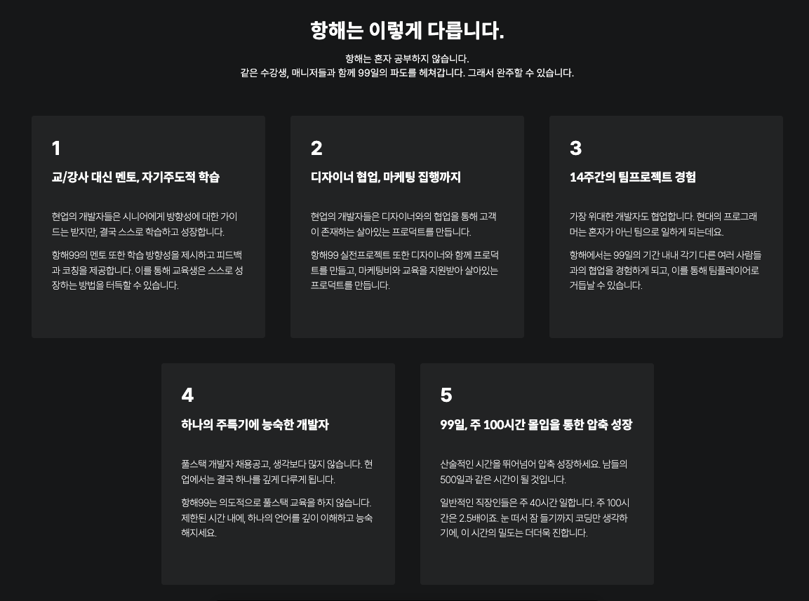
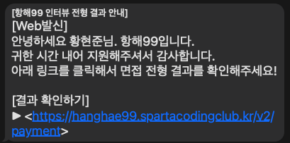

 

># 항해99

항해99는 99일 동안, 9to9 주 6일 동안 진행되는 개발 부트 캠프 프로그램입니다.

커리큘럼은 Java 기본기부터,  
React, Node.js, Spring 중 자신의 주특기를 골라 더욱 실력을 업그레이드할 수 있으며,

항해 진행 중 여러 프로젝트를 각기 다른 팀원과 진행해
커뮤니케이션 능력까지 기를 수 있다고 합니다.

## 항해99를 선택한 이유.
하던 일을 그만두고, 나이 30이 되기 전에 하고 싶었던 것을 해보자는 생각을 하게 되었고,

국비과정 혹은 부트 캠프를 알아보던 도중,
3가지 조건 정도를 보고 진행하였는데,

1. 최대한 빨리 시작하는 프로그램 일 것
2. 비용은 크게 상관없으나 부담이 되지 않으면 좋겠다.
3. 취업률이 높았으면 좋겠다.

제가 알아볼 당시 2022년 안에 제일 빨리 시작할 수 있던 프로그램은 항해99였습니다.  
또한 항해99는 선불제와 후불제가 있는데, 후불제를 선택할 경우 선불제 보다 살짝 가격이 비싸긴 하지만,

취업을 한 후에, 3~4달에 걸쳐 돈을 지불해도 된다는 점도 좋았습니다. 

그리고 취업률 또한 괜찮다고 평가받고 있었으며,

이력서 코칭이나 전용 채용 플랫폼, 다수 협력사 보유 등등 이 괜찮다고 생각되었습니다.

그리고 가장 마음에 들었던 점은, 현재 내가 가지고 있는 열정을 쏟아붓기에  
항해 99의 커리큘럼이 좋겠다고 생각했습니다. 

현재 일을 안 하고 있기에, 이 시간을 최대한 활용해야 한다고 생각하였고,  
그 결정에 9to9이라는 점은 제일 크게 와닿았습니다.

그리고 9to9이지만, 사실 거의 밤 11시 ~ 12시까지는 진행한다고 하네요!

## 항해99 준비 과정
항해99 홈페이지를 통해 참여 의사를 밝히면, 하루 이틀 내에 
담당관? 분과 면접 겸 상담을 받게 됩니다.

이러면 하루 정도 내에 합격인지 불합격인지 연락이 오는데,  
사실상 돈 내고 다니는 학원과 같기에, 인성에 큰 문제가 없다면 합격이 될 것 같습니다...  

그렇게 합격을 하게 되면, 각종 언어 문법 강의와, 웹 개발 종합반이라는 인터넷 강의를 받게 되고,  
슬랙, 노션, Zep 등 각종 메신저, 메타버스 플랫폼 등을 사용할 수 있게 준비합니다.

그리고 신청자에 한하여 사전 스터디를 만들어주고, 같이 나아갈 수 있도록 방향을 제시해 줍니다.  
그래서 항해가 시작하기 전 목표는 웹 개발 종합반(5주 분량 강의)이라는 강의 2회 완강을 목표로 해서

전반적으로 웹이 돌아가는 사이클을 빠르게 맛볼 수 있게 해주는 것 같습니다.  
참고로! 웹 개발 강의를 기준으로 OT 주차에는 입학시험도 있다고 하네요.

