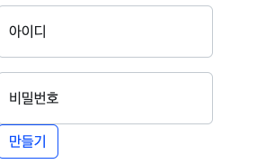
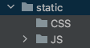
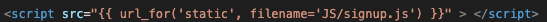
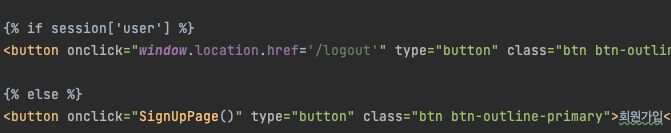
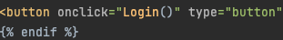
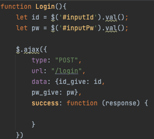
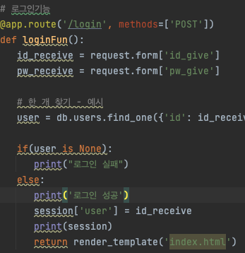
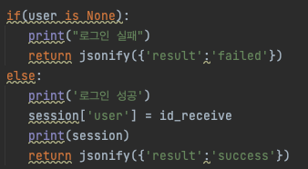
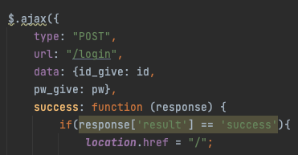
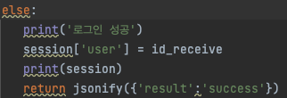

<br>

># 항해99 첫 날

오늘은 항해99 첫날이다.
자신의 선택에 따라, 웹 개발 종합반 강의 완주 팀과 토이 프로젝트 2가지 팀으로 나누어지었고,

나는 웹 개발 목표치인 2회독을 완강하여 토이 프로젝트에 도전해 보고 싶어 토이 프로젝트에 참여하였다.
팀플레이가 이렇게 어려웠던가?

토이 프로젝트 회의 결과,
3일 밖에 시간이 없기 때문에 사이즈가 큰 프로젝트는 하지 못하고,

목요일이 시험인 관계로 복습 겸, 각자 프로젝트를 만들기로 하였다.
항해 진행 중 강민철 튜터님의 “TIL/WIL(회고)” 특강에 감동받아

최소한 항해를 하는 99일 동안은 TIL을 매일 작성하기로 마음먹고 쓰게 되었다.


># 웹 메모 사이트

## 목표
Python, flask, mongodb를 이용한 로그인 기능이 있는 웹 메모장을 만들어보자!

## 문제점
웹 개발 종합반이라는 강의에서 웹 사이클을 경험하여, 실제 ec2 환경에서 배포해 본 것은 맞지만  
이것들을 이용해 처음부터 프로젝트를 만들려고 하니, 퍼즐을 맞추는 것처럼 생각보다 어려웠다.
그래도 어려운 점이 나올 때마다 다시 강의를 보고, 정리를 해보자는 마음으로 프로젝트를 시작하였다.


## input과 label?
그러던 중 회원가입 기능을 구현하던 중,  
버튼을 누를 때 아이디, 비밀번호 값을 .val()로  
가져와야 하는데 이상하게 잘 동작하지 않는다  


```html

<!-- 동작하지 않던 코드 -->
<div class="form-floating mb-3 w-25">
  <input type="email" class="form-control" id="floatingInput" placeholder="name@example.com">
  <label for="floatingInput" id="inputId">아이디</label>
</div>
<div class="form-floating w-25">
  <input type="password"  class="form-control" id="floatingPassword" placeholder="Password">
  <label for="floatingPassword"id="inputPw">비밀번호</label>
</div>
```

왜 안될까 하고 한참 생각해 보았다.
그리고 input 태그와 label 태그에 대해서도 더 찾아보았다.

label은 폼의 양식에 이름 붙이는 태그이다.
주요 속성은 for이다. label의 for의 값과 양식의 id의 값이 같으면 연결된다.
label을 클릭하면, 연결된 양식에 입력할 수 있도록 하거나, 체크를 하거나, 체크를 해제한다.

결과적으로 값 자체는 input 태그의 값을 가저와 한다는 것을 알았다.
라벨 태그는 아이디, 비밀번호 같은 글자를 인풋 태그 안에 넣기 위해서 사용한 말 그대로 라벨인 것이다.

이런 기본적인 input 태그도 틀리다니..  
한 가지를 집중적으로 파지 않고, 여러 가지를 단시간 안에 공부한 역효과 같다.

## index.html에 너무 많은 스크립트  
index.html을 만들고 자바 스크립트 함수 등을 작성하려는 순간 이런 생각이 들었다.  
이런 식으로 함수들을 만들면 너무 길고 복잡해지겠는데??

그래서 폭풍 검색하였다.  
결론적으로 아래 블로그를 참조해서 static에 js 폴더를 만들어 따로 보관하기로 하였다.

[참조한 블로그](https://infinitt.tistory.com/119)







## 로그인 시 쿠키, 세션 무엇을 이용하며 어떻게 사용할까?

기본적으로 로그인, 회원가입의 경우 DB 연동해  만들었지만 플라스크에서  
얼핏 들어본 쿠키나 세션 처리는 어떻게 하며   

비밀번호 같은 중요 정보에 대한 암호화는 어떻게 할까?에 대해서 고민해 보았다.


일단 쿠키와 세션에 대해서 파본 결과,

보안면에서는 세션이 뛰어나지만 서버에 저장되는 관계로 메모리 부하가 있을 수 있고
쿠키는 보안면에서 살짝 떨어지지만 클라이언트 로컬에 저장되기 때문에 서버에 부하가 없다.

사실상 SSL 인증도 없고, 이러한 개인 토이 프로젝트에 누가 실제 비밀번호를 입력할까..  
싶어 쿠키로 해보려고 하다가, 그래도 로그인 기능은 세션에서 하는 게 맞는다고 해서 세션으로  
진행해 보았다.


### 문제점.

세션으로 하던 중 문제를 맞닥뜨렸다.

index.html에서 세션 여부에 따라  
로그아웃 버튼이 보일지 혹은 로그인, 회원가입 화면이 보일지  
플라스크에 있는 Jinja2라는 템플릿 엔진을 이용하여 설정해 놓고,



로그인 버튼을 누르면 login ajax가 동작하고  


로그인 성공이 되어도 index.html이 렌더링 되지 않는다...  



return render_template('index.html')와  
return redirect(url_for('index'))다 써봐도 되지 않는다.

redirect의 경우 무조건 경로를 /로 보내 app.route /가 받게 된다.  
그럼 Jinja2의 문제인가? 

심지어 바보같이.. ajax가 비동기 방식이라 그런가? 해서 ajax를 동기방식으로 바꿔도 보았다.  
뭐 이러면서 알아 가는 거지!  



### 해결
바보같이, 왜 안되는지 디버깅을 해보지 않고,  
플라스크가 알아서 렌더링 해서 띄워 주겠지?라는 생각을 하고 있었다...

에이잭스로 보냈기에 응답이 리스폰스로 오는 것을 모르고, 왜 안 되나.. 계속 생각하다가
콘솔로 찍은 response를 개발자 도구로 직접 확인하고 나서야 알게 됐다...

response에 생 HTML 코드가 다 담겨 있었다.
--> 당연하지.. ajax로 보냈으니 ajax에 rsponse에다가 렌더링을 하지...

그래서 ajax에서 따로 링크를 걸어 주었다.  
로그인에 성공하여 response에 success가 담긴다면 페이지를 리로딩 하도록 해줬다.  


app.py도 이렇게 바꿔 주었다.



배운 점 
- input 태그와 label 태그의 차이
- flask의 전반적인 구조
- CSS, JS 파일의 분리로 깔끔한 코드 작성
- 플라스크에서의 세션 구조!
