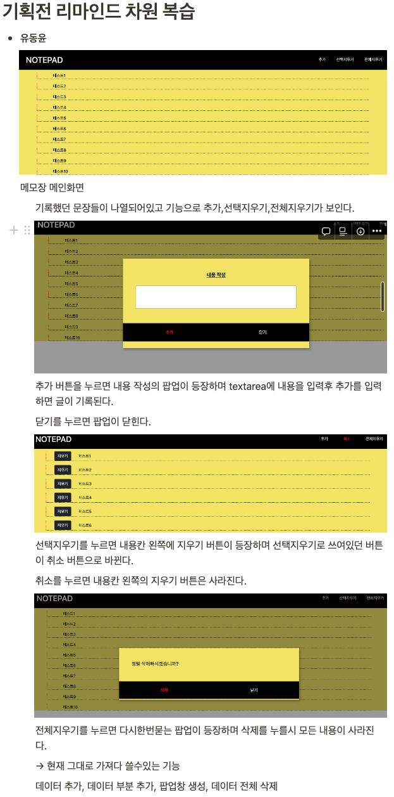
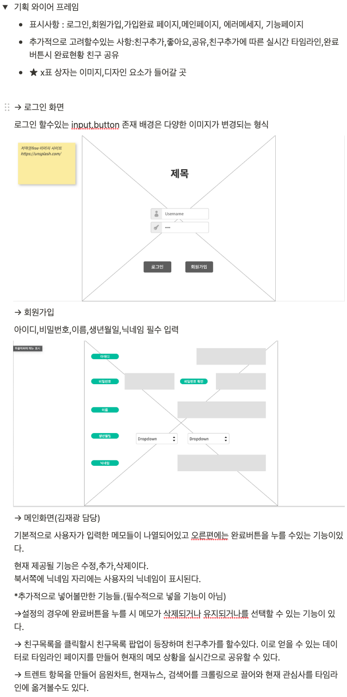
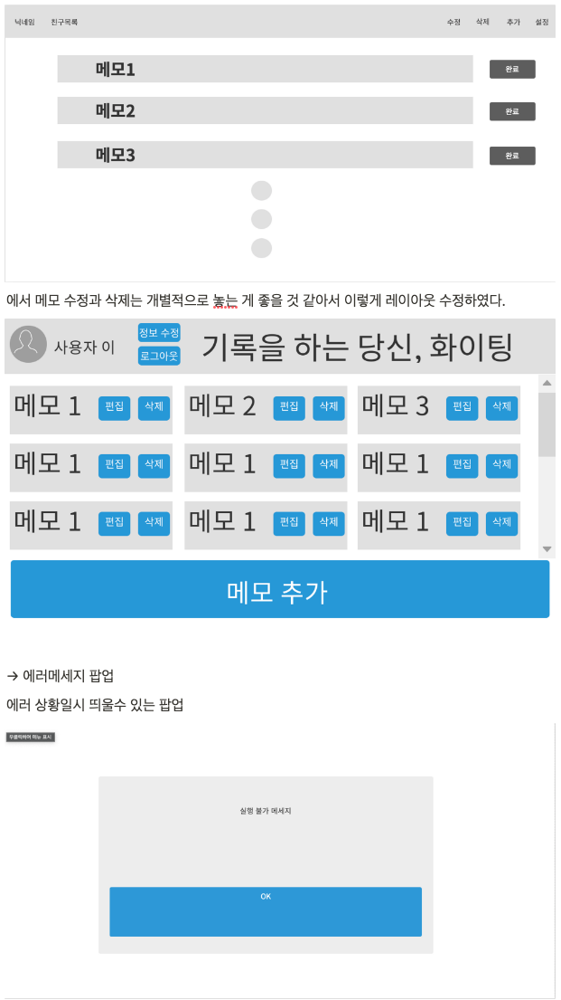
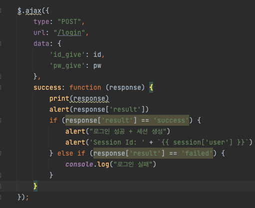
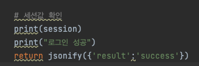
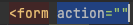
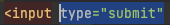
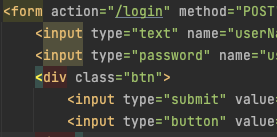
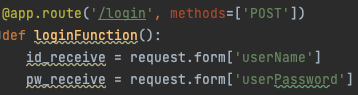

<div class="notice" style="text-align:center">
          개발 환경<br>
          - 2021, 맥북 프로 M1 Pro 14인치 모델 <br>
          - Ventura 13.1
</div>
<hr>

<div class="notice--info" style="text-align:center">
          버전<br>
          Python 3.9<br>
          Flask 2.2.2<br>
          bcrypt 4.0.1<br>
          PyCharm 2022.2.3 (Professional Edition)<br>
          
</div>
<hr><br>

## 고생길..
토이 프로젝트하라고 팀을 만들어 줬건만, 개인플레이를 하는 우리 팀(나 포함)...  
오늘 다시 회의를 하고, 튜터님들의 조언 등을 통해 하루 이틀 남은 시점에서 다시 팀플레이로 바뀌었다.


그래서 해당 와이어 프레임과 계획으로 다시 목표를 짰고  
노션에 깔끔하게 작성해 준 팀장님과 팀원님들.








## 내 역할
나는 이전 프로젝트에서 메모 기능보다 로그인 기능을 먼저 만들고 있고,  
다른 사람들은 메모 관련 로직을 만들고 있어서 내가 로그인, 회원가입 기능 등을 맡게 되었다.


## 목표
- 회원가입, 로그인 구현
- 세션 구현.
- 비밀번호 암, 복호화 구현하기

확실히 먼젓번 만들었던 혼자 한 프로젝트에서 로그인 구현을 혼자 어느 정도 해보고 나니 프로젝트에 표현하기가 한결 쉬워졌다.


## 문제점

이렇게 보냈는데  


서버 단 로그인 성공 시  


왜 도대체 alert나, log가 안될까? 응답이 안 오나?

..한참 동안 해본 결과

이 부분을 작업한 사람이 여기서 왜 이렇게 해놨을까를 한 번 더 생각해 보았다.  
저 폼 action을 왜 해놨고 사용하라는 듯이 "" 큰따옴표까지 써놔주었다.  
계속 찾아보고 생각해 보니 form 태그라는 게 있으며,  
get과 post 방식으로 간단하게 폼을 보낼 수 있다고 한다!




안 됐던 이유는,  
원래 시도한 방식은 이런 방식인데  
input 태그 id -> 에이잭스(id, pw) -> post 요청 -> 플라스크 백단(로그인 처리) -> response 응답

id 태그 + onclick="function()" 조합으로 에이잭스에서 불러와도 form에 action 태그가 먼저 처리되어
get으로 요청하고 있어서 안 되는 것이었다.


그래서 아래와 같이 바꾸었다.  

form 태그 ( input에서 id가 아닌 name으로) -> post 요청 -> 플라스크 백단(로그인 처리) -> 템플릿 뿌려주기로 바꾸었다.  
  



[참조 블로그](https://goodsgoods.tistory.com/240)

그래서 굳이 가져올 데이터가 없으면 ajax로 안 보내고,  
fomr 태그로 보내면 되겠다는 것을 깨달았다.


결론적으로 이런 생각을 해 보았다.  
프론트 단에서 유효성 검사 -> 백엔드 유효성 검사 (화면 변화 없이) 하려면 에이잭스
프론트 단에서 유효성 검사를 하지 않고 간단하게 보낼 시 form 태그로 

## 이것 역시 주입식 교육의 폐해??
처음에 보라고 던져준 웹 개발 종합반 강의에서는 form 태그는 보지 못하고  
ajax만 썼는데.. 그래도 이렇게 하다 보니 틀렸던 점이 기억에 남는 것 같다.


## 암호화/복호화

또 다른 목표였던 세션과 암호화/복호화는 순조롭게 진행이 되었다.  
암호화는 파이썬 패키지로 있는 bcrypt 방식을 이용하였고,  
세션은 flask에서 지원하는 session을 이용하였다.


<details>
<summary>암호화</summary>

<div markdown="1">

```python  

def signUpFunction():

    id_receive = request.form['id_give']
    pw_receive = request.form['pw_give']
    name_receive = request.form['name_give']
    nickname_receive = request.form['nickname_give']
    email_receive = request.form['email_give']

    # 비밀번호 암호화
    pw = pw_receive.encode('utf-8')

    pwSalt = bcrypt.gensalt(12)
    pwHash = bcrypt.hashpw(pw, pwSalt)

    insertPwHash = pwHash.decode()
    print(insertPwHash)

    id_check = db.users.find_one({'id':id_receive})
    # ID 중복 체크
    if(id_check != None):
        print("해당 ID 존재합니다.")
        return jsonify({'result': 'failed'})
    else:
        doc = {
        'id': id_receive,
        'pw': insertPwHash,
        'name': name_receive,
        'nickName': nickname_receive,
        'email': email_receive
    }
        db.users.insert_one(doc)
        return jsonify({'result': 'success'})

```

</div>
</details>


<details>
<summary>복호화</summary>

<div markdown="1">

```python  

@app.route('/login', methods=['POST'])
def loginFunction():
   id_receive = request.form['userName']
   pw_receive = request.form['userPassword']

   # 비밀번호 복호화
   user = db.users.find_one({'id': id_receive}, {'_id': False})

   if(user == None):
      return render_template('signInPage.html')

   result = bcrypt.checkpw(pw_receive.encode('utf-8'), user['pw'].encode('utf-8'))

   if(result == False):
      return render_template('signInPage.html')

   elif(result == True):
      session['user'] = id_receive

      return render_template('memo.html')


```

</div>
</details>


<details>
<summary>세션</summary>

<div markdown="1">

```python  
from flask import session

# 중요한 키, 유출되면 안 됨
app.secret_key = b'aaa!111/'


    #세션의 user에 로그인한 아이디가 담긴다.
    #id_receive 로그인 성공 시 해당 id 담기
    session['user'] = id_receive

    #세션 삭제
    session.pop('user', None)

```

</div>
</details>


배운 점
- js 공백, 메일, 단어 등등 체크 시 정규 표현식을 쓰는구나
- 유효성 검사의 중요성
- form 태그 get, post 방식 - ajax get, post 방식
- 암호화/복호화, 세션 찍먹

