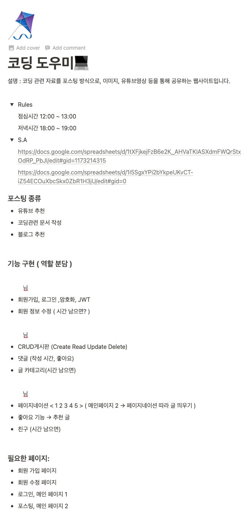
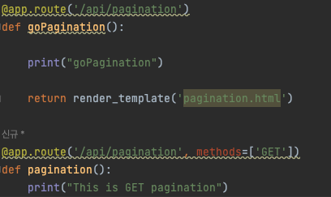
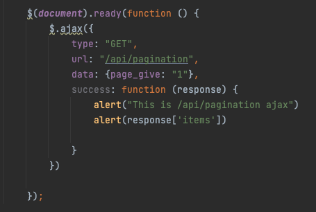
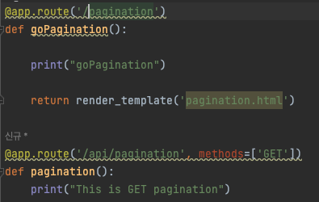

          개발 환경 
          - 2021, 맥북 프로 M1 Pro 14인치 모델  
          - Ventura 13.1

# 제대로 된 첫 프로젝트 시작
오늘은 첫 풀스택 프로젝트를 하는 날이다.  
팀장을 맡게 되었다...  
분명 팀원이 4명이라 했는데 1명이 들어오지 않았고  

3명이서 해야 될 것 같은 느낌이 들었다 ..ㅠㅠ

팀원 한 명이 들어오지 않아.. 어쩔 수 없이 3명이서 진행했다.

## 협업을 하기 위해 무엇이 필요할까?
컴퓨터를 잡고 키보드를 두들기기 전, 이 협업의 프로세스를 익혀놓으면 나중에 가서 도움이 될 것 같았고  
협업을 하기 위해 무엇을 알아야 하는지 많이 찾아봤다.

### 노션
실제로 많이 쓰이는지는 모르겠지만, 항해99에서 노션을 자주 활용하기에 노션에
기획 및 와이어 프레임 등을 관리하기로 했다.  

### 깃허브
깃허브는 파일 버전 관리, 협업을 위해서 사용했고, 깃 관리 앱은 깃허브 데스크탑을 사용하였습니다.  
확실히 깃허브가 없었다면.. 협업을 어떻게 할지 생각만 해도 ㅎㅎ

### Mongo DB (atlas)
Database는 아틀라스의 Mongo DB를 사용하였고,
무료로 사용 중이기에, 아직은 만족합니다만 ㅜㅜ

가끔가다 웹에서 Collection이 접속이 안되는 경우가 많아 살짝 불편합니다.

### 와이어 프레임 작성 웹툴
와이어 프레임 작성에는 excalidraw를 사용하였습니다  
실시간으로 가볍게 할 수 있어 좋은 것 같고, 실시간으로 마우스가 보이는 게 신기하네요.
[excalidraw](https://excalidraw.com/) 

## 협업 진행 방식
일단 노션으로 기획 및 대략적인 와이어 프레임, ERD, API 명세, 역할 분담을 의논하고  
시작하였습니다.

### 힘들었던 점
기획을 잡고 데이터베이스와의 관계, API를 하면서 작성하는 게 아닌  
기초부터 미리 계획을 한다는 것이 해보지 않아서 그런지 어려웠고,  
여기에 익숙해져야겠다는 생각도 했습니다.

### 역할 분담
나는 저번 시간에 암호화(bcrypt hash), 로그인, 회원정보  수정, 세션 등을
구현해 봤기에, 이번에는 다른 것을 해보며 삽질을 좀 많이 해보고 싶었기에,

페이지 네이션(포스트 표시), 좋아요 기능, 친구 기능 등을 구현해 보도록 하였다.

# 기술적으로 힘들었던 점 -> 해결
아래 2개의 /api/pagination이 존재하는데,  
ajax GET 방식으로 아래의 /api/pagination으로 데이터를 보내는대  
왜 응답이 안 오는지 한참 동안 고민했습니다. ㅜ

알아보고 생각해 본 다음 깨달았습니다.  
GET 방식을 써주지 않더라도 기본적으로 GET 방식으로 동작해서  
위/아래 두 개의 /api/pagination을 구분하지 못한다는 것을..

그래서 아래와 같이 페이지 이동만을 위한 뷰 함수와 api 페이지의 네이밍을  
확실하게 해서 해결하였습니다.

## 페이지 네이션

일단 먼저 페이지 네이션을 구현해 보려고 계산식을 계속 짜보았는데  
도저히 제 머리로는 구현이 안 돼서 구글링을 좀 많~이했습니다.

근데 아무리 코드를 복붙해도 안되길래, 어느 정도는 복붙하고  
그 뒤로는 기능을 이해하며 만들어나가며 만들었습니다.

TIL이기 때문에 모든 코드를 다 올리기엔 너무 길고,  
간단히 말하자면,

페이지 네이션 할 페이지 수, 한 페이지당 포스트 수, 현재 페이지 등을 받고,  
페이지 네이션 시작 블록, 현재 위치, 끝 블록 등으로 계산을 해서

HTML에서 Jinja2로 해결하고, 글을 불러오는 같은 경우는 몽고 db 기준  
아래와 같이 해결했습니다. (중간의 skip은 계산식이 따로 있음.)  
-> 이 mongo db 쿼리문도 터미널 혹은 다른 곳에서 사용할 때랑 파이썬이랑 다른지 많이
찾아본 다음 알아냈습니다,  
구글링 해도 많이 안 나오는 정도..  (뭔 중괄호가 그리 많은지..)

    all_posts = list(db.posts.find().sort('_id', pymongo.ASCENDING).skip(skip).limit(postsLimit))

## 페이지 네이션을 구현하며 어려웠던 Jinja2
난생 써보지 못한 Jinja2에 페이지 네이션을 구현하려고 하니, 
HTML에서 동적인 기능을 쓴다는 게 신기하고, 생각보다 어려웠습니다.. 

Jinja2를 사용하다 깨달은 점은,  
A라는 페이지 HTML로드 시에 ajax를 통하여 비동기로 데이터를 가지고 왔다면  
그 데이터는 Jinja2로 A 페이지에서는 사용하지 못하는 것 같습니다.

아예 렌더링이 끝나면 Jinja2의 역할도 끝나는 것 같습니다.  
그래서 많이 헤매었는데, 원래 하던 방식이  
페이지 네이션이 되는 Page 접속 -> 문서 로드 시 ajax 스크립트 불러와 페이지 네이션 표기 방식이었다면

ajax로 불러오지 말고 서버단에서 처음 페이지 네이션을 미리 계산해서 가지고 오고,  
버튼 클릭 시 url로 접근하여  다시 가지고 오는 방식으로 하니 잘 진행되었습니다.  
(버튼 클릭 시 url_for로 이동합니다.)

