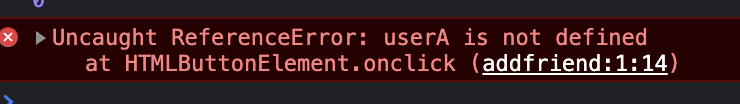
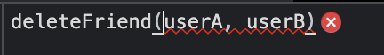
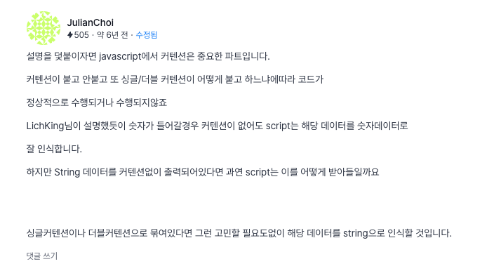
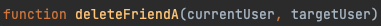

<div class="notice" style="text-align:center">
          개발 환경<br>
          - 2021, 맥북 프로 M1 Pro 14인치 모델 <br>
          - Ventura 13.1
</div>
<hr>

# 생각 먼저 하기!
어느덧 항해 6일차이다.  

짧은 시간이지만 밤낮을 고생하며 했기에 나도 모르게 빨리 성장을 하고 있는 것 같다.  
그리고, 프로젝트 및 세션을 진행해오면서 느낀 점이 크게 2가지가 있는데,

1. 생각 먼저 하기  

무엇을 뭉뚱그려 생각하고 코딩을 먼저 하게 되면 오히려 중간에 막혀서 다시 코딩-> 구글링의 반복이 된다.  
애초에 어느 정도는 틀을 잡고 생각을 하고 진행하고, 중간에 막힐 경우 그냥 막 하지 말고 로그 등을 잘 띄우거나 개발자 도구를 사용하여 에러가 나는 부분의 앞단 뒷단을 잘 확인하며 진행하면 금방 에러를 찾고 고칠 수 있게 되는 것 같다.

1. 피곤하면 그냥 자기..  

위의 1번에서 생각 먼저 하기는 곧 작업시간을 단축할 수 있는 지름길이다.. 그런데  
너무 피곤하면 위의 생각하기가 멈추고 그냥 키보드만 두들기게 돼서 오히려 시간만 버리고 효율은 없게 된다.
그래서 휴식도 중요하다는 것을 깨달았다!


## 친구 기능
친구 기능을 만들어 보고 싶었다.  
그래서 내 머리는 장식이 아니니... 생각이라는 걸 해보았다.

일단 유저 테이블은 건드리지 않고 구현하고 싶었고,
1. 친구 신청 중
2. 친구 수락 대기 중
3. 친구인 상태

위의 3가지 기능을 구현하고 싶었다.

지금까지 개발을 해보며 느낀 것은 데이터(DB)의 활용이 매우 중요하고 데이터만 잘 꺼내오면 
나름.. 쉽다?라는 걸 느꼈다.

그래서 저위의 기능을 데이터베이스에 어떻게 넣을까 하고 생각해 보았다.

결과적으로 친구를 신청한 사람과 친구 신청을 받는 사람이 나누어져야 수락 대기 중, 신청 중이 구현 가능할 거라고 생각하여 아래처럼 짜보았고, 친구 상태를 나타내기 위해 isFriend를 넣어보았다.

======하나의 테이블===================  
friend_currentUser      "userA"  
friends_targetUser      "userB"  
friends_isFriend        "0 or 1" 

위처럼 계획하게 되면  
4가지의 경우의수로 (userA가 나의 계정이라고 치면)

userA --친구 신청 중--> userB  
currentUser userA, targetUser userB isFriend 0

userA --친구신청 완--> userB  
currentUser userA, targetUser userB isFriend 1

userB --친구 수락 대기 중--> userA  
currentUser userB, targetUser userA isFriend 0

userB --친구신청 완--> userA  
currentUser userB, targetUser userA isFriend 1

위처럼 동작할 수 있겠다는 생각을 했다.  
( 친구 삭제 시 테이블 통째로 날리기 )

정확한 기능 설명이 아니라 내가 어떻게 이 문제를 해결했고 생각했는지 만을 적겠다..!  
그래서 현재 위의 기능은 다 구현을 했고,

유저 테이블에서 유저들을 뽑아와 버튼만 옮겨 사용할 수 있게 해놓았다.


## Jinja2 헤매었던 점

아래와 같이 만약에 2개의 온 클릭이 있다고 하면,
onclick 옆 deleteFriend 안의 매개변수의 순서는 다르지만,

실제로 ajax로 도착할 때는 순서 상관없이 변수 이름에 맞추어들어간다...
(자바스크립트 함수 매개변수 이름이 달라도 동작 안 함)

```javascript

<button onclick="deleteFriend(${currentUser}, ${targetUser})"> 절교</button><br>`

<button onclick="deleteFriend(${targetUser}, ${currentUser})"> 절교</button><br>`


    function deleteFriend(currentUser, targetUser) {

        $.ajax({
            type: "POST",
             url: "/api/deletefriend",
             data: {
                currentUser_give: currentUser,
                targetUser_give: targetUser
              },
              success: function (response) {
                   alert(response)
              }
           });

    }
```


## 그래 값은 넘어왔지만..?

여차여차해서 userA, userB가 넘어왔지만 또 아래처럼 에러가 발생한다.  
이런 에러가 뜨는 것일까?  





값은 넘어오지만 뭔가 정의 가 안 돼있다는 것 같다?  
저기 안의 글자가 ""가 안 감싸진 문자열이다? -> 문자열이 아닌 변수로 인식하는 것일까 해서

toString() String()을 써봐도 Uncaught ReferenceError: userA is not defined만 뜬다..
아예 변수로 인식해서 안 되는 것 같다.

currentUser를 type of로 확인해 봐도 스트링이라 나오는데 왜 안 되는 것일까?


한참 찾아보다가 아래의 글을 보고 해결하였다.


아.. 자바스크립트란 이런 것이구나.. 혹시 유튜브 댓글에서나 봤던
자바스크립트가 타입에 자유로워 안 좋은 언어라는 게 이런 뜻일까?라고 생각해 봤다.

왜냐 나는 스트링 타입인 걸 확인하고 보냈는데 갔더니 변수가 돼있네..?


```html
<button onclick="deleteFriend('${currentUser}', '${targetUser_give}')"> 절교</button><br>`

  <button onclick="deleteFriend('${targetUser_give}', '${currentUser}')"> 절교</button><br>`
```


그리고 아까 위에서도 말했지만 위처럼  
'${currentUser}', '${targetUser_give}' 와  
'${targetUser_give}', '${currentUser}' 가 있으면  

나는 아래 함수에서 순서에 따라 a, b 혹은 b, a로 받을 줄 알았지만${} 안의 똑같은 이름으로 받는다..
결국 위의 2개씩 구분해 놓은 것이 의미 가 없는 것. 

매개변수의 순서가 상관이 없다.. ㅜㅜ 실제로 함수의 매개변수 이름만 바꿔도 동작하지 않음.
Jinja2에서 이렇게 만들어놨나 보다.




그래서 매개변수의 순서가 다르게 사용하고 싶다면,  
자바스크립트 내의 매개변수 순서를 변경하여 함수를 하나 더 만들어줘야 한다.  

그래서 그냥 A, B로 이름을 바꾸고 매개변수 순서만 달리하여 두 개의 함수를 만들었다. 

어차피 뭐 함수 하나 더 있다고 해서 엄청난 부담이 될 것 같진 않다!

근데 또 문제점이 있다. 여기서 데이터를 구분하기 위해 보낸다 해도  
서버에서는 누가 누군지 인식하지 못한다 json 타입의 앞에 key 값이 currentUser, targetUser로 같기에!

그래서 아래처럼 어떤 유저가 어떤 유저에게 친구 신청을 하는지 같은 것들을 구분하기 위해 방향 ab, ba를 넣어주었다.

        function deleteFriendA(currentUser, targetUser) {

            $.ajax({
                type: "POST",
                url: "/api/deletefriend",
                data: {
                    currentUser_give: currentUser,
                    targetUser_give: targetUser,
                    order:"ab"
                },
                success: function (response) {
                    location.reload();
                }
            });

        }

                function deleteFriendB(targetUser, currentUser) {

            $.ajax({
                type: "POST",
                url: "/api/deletefriend",
                data: {
                    currentUser_give: targetUser,
                    targetUser_give: currentUser,
                    order:"ba"
                },
                success: function (response) {
                    location.reload();

                }
            });

        }


굳이 이렇게 해야 하나 싶겠지만 A, B 중 누가 삭제하는지 모르면  
해당 사용자의 친구가 다 지워지거나 할 수 있기 때문에

정확히 누가 누구를 삭제하는지를 알아야 하기 때문에 저런 식으로 만들었다.  
플라스크 백엔드단의 경우 아래처럼 짜봤다.. ( 이게 맞는진 모르겠다 ..)

```python
    currentUser_receive = request.form['currentUser_give'] ## 나
    targetUser_receive = request.form['targetUser_give']
    order = request.form["order"]


    if(order == "ab"):
        db.friends.delete_one({'friends_currentUser': currentUser_receive, 'friends_targetUser': targetUser_receive})

    if(order == "ba"):
        db.friends.delete_one({'friends_targetUser': currentUser_receive, 'friends_currentUser':targetUser_receive })
```
