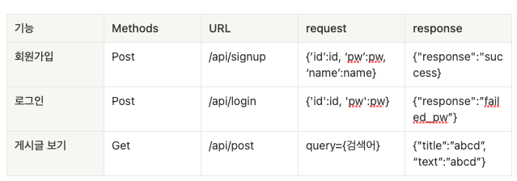

          개발 환경 
          - 2021, 맥북 프로 M1 Pro 14인치 모델  
          - Ventura 13.1

# 항해 일주일
항해99를 시작했던 것이 엊그제 같은데 벌써 7일차가 되어서 Week i learned를 쓰고 있다.  

사실 시작하기 전에 걱정했던 점은, 내가 9to9을 잘 실행할 수 있을까?,
강의 수준을 잘 따라갈 수 있을까라는 내용이었지만,

오히려, 집중을 하게 되니 9시보다 일찍 들어와서 11시쯤 나가고 자고의 반복인 생활을 하고 있다.
또 시간을 투자하니 그만큼 실력이 빨리 느는 것 같기도 하다.

아직까지는 큰 실수 없이 잘 하고 있는 것 같다.

 

# 이번 WIL의 키워드 JWT, API

## JWT 
[JWT 자세히](https://hyunjunhwang1994.github.io/%ED%95%AD%ED%95%B499/JWT/)
JWT에 대한 자세한 포스팅은 링크의 글에 있습니다.

사실 처음에 세션, 쿠키에 대해서는 어느 정도 알고 있었지만,  
JWT라는 토큰에 대해서는 잘 알지 못하고 있었다.

JWT .. 존맛탱 처럼 생겼다.

그래서 토큰 안에 정보가 다 담겨 있는데 이게 어떤 식으로 사용되는 건지 감이 잘 잡히지 않았고
포스팅과, 직접 코딩을 통해 공부해 보았다.

일단 내가 생각했을 때 JWT를 사용하는 이유는,
1. 서버의 메모리나, 따로 Database를 필요로 하지 않는다.
2. 사실 안의 Header와 PAYLOAD는 Base64로 인코딩 되어 있기 때문에,
쉽게 안의 내용을 디코딩 해서 볼 수 있지만, Signature 부분의 경우 
header(base64) + "." + payload(base64)을 Secret Key로 해쉬하기 때문에
3. 서버에서만 검증(Secret Key를 알아야만) 할 수 있다는 점에 장점이 있는 것 같다. 
   (payload 안의 데이터는 서버에서의 활용도만 중요하고 밖에서는 아무 의미 없는 데이터여야 하는 것 같다.)
4. 토큰의 크기가 커질수록 데이터베이스의 용량은 차지하지 않지만
네트워크에 부하는 올 수 있다 한다.

내가 생각한 단점
1. 토큰 탈취 시 해당 홈페이지에서 사용자인 척할 수 있음  
   ㄴ 이러한 단점들의 보완을 위해 jwt refresh token이라는 것이 있다고 한다.
2. 해당 사용자를 강제 로그아웃 시킨다든지, 해당 사용자의 로그인 관련 정보를 수집한다든지의
기능을 사용하지 못함

## API

사실 API라는 용어는 많이 들어봤지만, 정확히 개념이 잡히진 않았었기에 WIL을 쓰며,
회고해 보도록 했다.

[나무위키](https://namu.wiki/w/API)
Application Programming Interface   
응용 프로그램 프로그래밍 인터페이스. 프로그래밍에서, 

프로그램을 작성하기 위한 일련의 부(Sub) 프로그램,  
프로토콜 등을 정의하여 상호 작용을 하기 위한 인터페이스 사양을 말한다.

API는 흔히 function, method 또는 operation 등으로 다양하게 불리는  
'소프트웨어 컴포넌트'의 기능, 입력, 출력, 그리고 이에 사용되는 자료형으로 표현된다.  

API 자체는 어디까지나 사양(specification)만을 정의하기 때문에 구현(Implementation)과는 독립적이다. 
앞서 언급했다시피 이를 실제로 구현한 것은 '라이브러리(library)'라고 부른다.  

잘 설계된 API는 프로그램 개발을 보다 쉽게 해준다. API는 다양한 형태로 존재하며,  
유닉스의 POSIX 표준, 윈도우의 MFC나 Win32, C++의 표준 템플릿 라이브러리(STL), Java SE API 등이 이에 해당한다.

---> 뭔소린지 하나도 모르겠다.. 

내가 느낀 API?
서버단에서 일련의 기능들을 만들고 클라이언트가 해당 URL로 접근할 때
특정 서비스를 제공하는 것이라고 느꼈다.

예를 들면 아래와 같이 특정 로직을 수행하고 request 데이터 response 데이터를 활용하면
API인 것 같다. (제 생각입니다...)  

# 앞으로
앞으로도 지금처럼 꾸준히 공부해야 할 것 같고,  
블로그 포스팅을 하면서 공부한 것을 정리하니 도움이 많이 되는 것 같다.

TIL은 매일 쓰는 걸로!