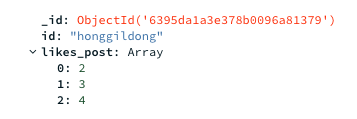
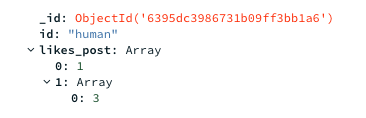
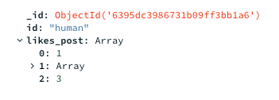
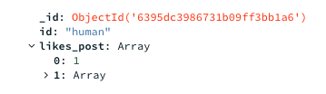
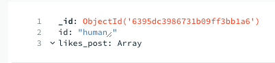
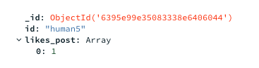

          개발 환경 
          - 2021, 맥북 프로 M1 Pro 14인치 모델  
          - Ventura 13.1

          버전 
          Python 3.9 
          Flask 2.2.2 
          PyCharm 2022.2.3 (Professional Edition) 
          

 

# 오늘 만들어 볼 기능

## 좋아요 기능 계획
오늘은 좋아요 기능을 만들어보려고 합니다.

좋아요를 단순히 게시글에 좋아요 수만 표기할 경우  
어떤 유저가 좋아요를 누른지 파악하지 못하므로

좋아요 DB를 만들고, 유저 id와 post id를 넣어  
좋아요 클릭 시 post_id에 인덱스 추가  
좋아요 해제 시 post_id 인덱스 해제

+ 좋아요 클릭 시 -> 포스트의 좋아요 컬럼에 1추가 하는 방식으로.  
해당 사용자의 모든 좋아요 해제 시 해당 유저의 컬럼 삭제로 해보려고 합니다.

하기 전에  mongo DB를 구글링해 보니  
post_id의 벨류 값에 배열을 넣을 수 있는 것 같고,  
배열 안의 데이터로 좋아요 된 포스트의 uid를 활용하여 좋아요 기능을 구현해 보려고 한다. 

    Likes DB  
    id          post_id  
    A              [1, 3]  
    B              [3]

    Post DB ( 게시글의 Likes가 몇인지만 확인 )  
    post_id      Likes  
    1               1  
    2               0  
    3               2

## 실행.
일단 데이터 삽입으로 배열 데이터가 가능한지 몽고디비로 확인부터 했다.  
네임, 벨류를 넣어야 한다

일단 파이썬 플라스크 기준으로 아래의 쿼리문으로

    doc = {"id":"honggildong", "likes_post":[2, 3, 4]}

    db.likes.insert_one(doc)

아래와 같이 만들었다.

-> 사실 데이터베이스에 배열이 들어간다는 건 잘 몰랐지만,  
이것을 활용하는 게 더 어려울 거 같기도 하고  
새로운 방법으로 사용해 보고 싶어서 배열로 사용했다.

[참조한 글](https://cionman.tistory.com/46)

그리고 나중에 가서 기능이 안돼서 빽 할 일이 없도록
미리 배열 안 데이터 수정 및 배열 제거 등등 
쿼리 작성 및 기능을 먼저 테스트를 해보고 진행하려고 합니다.

좋아요 클릭 기능 쿼리문 만들어보기.  
$push 연산자를 사용해 보았다.  
$push는 배열이 이미 존재하면 배열 끝에 요소를 추가하고, 

존재하지 않으면 새로운 배열을 생성한다.  
어찌어찌 쿼리를 만들어 아래와 같이 넣었지만

    query = {"id":"human"}
    new_values = {
        "$push": {"likes_post": [3]}
    }
    db.likes.update_one(query, new_values)

아래처럼 나와서 왜 안될까 하고 생각했다.

그래서 지금 현재 방금 추가한 likes_post: [3]이
사진상 배열의 인덱스에 한 번 더 들어가 있으니, 

일단 배열을 제거하고 처음 앞단부터 테스트해 보자 하고
아래처럼 넣었더니 바로 되어버렸다..!

    query = {"id":"human"}
    new_values = {
        "$push": {"likes_post": 3}
    }

아마 likes_post가 이미 배열이니 그냥 값만 넣으면 배열에 들어가는 것이었다...

좋아요 해제 시 배열에서 값을 꺼낼 쿼리를 만들어보기

아래 글을 참조하였습니다.  
[pull 참조](https://www.delftstack.com/ko/howto/mongodb/mongodb-remove-element-from-array/)

push를 이용하여 배열의 추가를 업데이트로 구현하였기 때문에 사실 배열 삭제의 경우 크게 어렵지 않았다.
pull을 이용하여 배열의 삭제를 하면 된다. ( 위의 push 코드랑 바뀐 건 pull밖에 없다.)

    query = {"id":"human"}
    new_values = {
        "$pull": {"likes_post": 3}
    }
    db.likes.update_one(query, new_values)

아래처럼 벨류 값이 3인 녀석만 잘 삭제된다. 

아까 배열 안의 배열로 들어갔던 데이터도 처음에 잘못 입력한 쿼리에 pull만 바꾸어 삭제하였다.

그리고 안의 데이터를 다 뽑아도 아래처럼 배열은 남아있는 것 같다.

갑자기 궁금한 게 생겼다.
push의 경우 배열 추가를 하면 배열이 존재하지 않아도 배열이 추가된다고 하였다.

그렇다면 업데이트 문에서 아래와 같이 human2 아이디가 없을 때 업데이트 쿼리를 날린다면
과연 human2를 만들어줄까? ( 이게 된다면 굳이 사용자가 처음 이용할 때의 insert_one 문은 필요 없을 것이다.)

    query = {"id":"human2"}
    new_values = {
        "$push": {"likes_post": 3}
    }

    db.likes.update_one(query, new_values)

아쉽게도 업데이트할 값이 존재하지 않는다면 값은 추가해 주지 않는다..
( 당연히 업데이트니까 추가는 안 해주는 게 맞는 것 같다.)

1. 그럼 사용자의 첫 좋아요를 눌렀을 때 -> 테이블 생성, 두 번째 좋아요부터 -> 업데이트 push가 이루어져야 하고,

2. 또한 사용자의 좋아요를 삭제하다가, 사용자의 좋아요가 다 삭제됐을 때?(모든 글에 좋아요 없음) 그 사용자의 테이블을 날려야 하나?
(안 날리면 데이터가 계속 차기에..)

1번 같은 경우 
if문을 사용하여 해당 사용자의 id를 likes 테이블에 검색해서 있다면 push 하고
못 찾았다면 insert하면 될 것이다.

2번 같은 경우
like_post  배열 안의 index 0 번의 존재 유무 확인 후 없다면 해당 테이블 날리기,  
0번이 있다면 해당 포스트의 좋아요만 삭제 정도로 구현하면 될 것이다.!

일단 위의 것들을 if문과 쿼리로 먼저 표현해 보고 진행해야지!

++ insert의 경우 회원 데이터 자체를 likes db에 다 집어놓고 시작하지 않는 이상  
++ 무조건 첫 좋아요의 경우 insert를 해야 한다.

하지만 좋아요 해제의 경우 마지막 좋아요를 해제해도 배열 자체는 삭제가 안되므로,  
테이블을 날릴 것이 아니라면 사실 좋아요를 최종적으로 삭제하는 건지 검사할 필요가 없다.

여기서 문득 데이터 저장방법에 대해서 생각해 보았다.  
1. 좋아요 기능을 post_user_id, post_uid로 구성하여 테이블을 1.생성 2.삭제. 1.생성 반복 -> 하며 데이터베이스의 용량을 관리해야 할까?

2. 아니면, 테이블을 post_user_id, post_uid[n1,n2, ...]  
1.생성 2.유지~~~~~ 3.삭제 1.생성하며 속도를 관리해야 할까?  
(사실 배열이 속도가 빠른지는 잘 모르겠다.. 왠지 그럴 거 같아서.)

안 해본 방법으로 구현을 해보고 싶어서 2번의 배열을 이용하여 구현을 해 보았다.

-> 어차피 삭제에서 좋아요가 없다면 테이블 삭제를 할 것이므로,  
-> 테이블 존재하지 않는다?는 곧 좋아요를 누른 적이 없다 가 된다.

    id = "human5"

    find_user = db.likes.find_one({'id': id})

    # 좋아요를 한 적 있다면 push로 배열에 값 추가
    if(find_user != None):
        query = {"id": id}
        new_values = {
            "$push": {"likes_post": 6}
        }
        db.likes.update_one(query, new_values)
    # 좋아요를 한 적이 없다면 insert로 테이블 구조 생성
    else:
        doc_array1 = {"id":id, "likes_post":[1]}
        db.likes.insert_one(doc_array1)

삭제의 경우 테이블 안의 배열 값에 대해서 존재하나 확인해야 한다.

이때 마지막 좋아요 버튼을 클릭할 때 빈 배열인지 확인하고
해당 테이블을 삭제해야 하므로 사이즈는 1로 준다. 

-> 마지막 좋아요 해제 시 좋아요 해제(배열 삭제) 쿼리가 아닌  
테이블 삭제 쿼리를 날림.

    id = "honggildong"
    post_id = 2
    find_user = db.likes.find_one({"$and": [{'id':id},{"likes_post":{"$size":1}}]})

    if(find_user == None):
        query = {"id": id}
        new_values = {
            "$pull": {"likes_post": post_id}
        }
        db.likes.update_one(query, new_values)
    else:
        doc_array1 = {"id":id}
        db.likes.delete_one(doc_array1)

[참조블로그](https://koonsland.tistory.com/120)  
[참조블로그-빈 배열 확인하는 법](https://honeystorage.tistory.com/194)

size가 0이라면? -> 어차피 여기서 size가 1인 것들의   
테이블을 다 삭제하기에 size0인 테이블이 생길 수 없음.

## 좋아요 보여주기
좋아요 보여주기 같은 경우  
해당 사용자(JWT or 세션) 체크 -> likes_post의 해당 유저의 likes 목록 불러오기  

-> 글 리스팅 할 때 if문으로 일치한다면 꽉 찬 하트 -> 불일치 시 빈 하트 보여주기  
(이때 글 리스팅 할 때 post_uid 순으로 리스팅 해야 함.)

좋아요 보여주기의 경우 글 보기 페이지에서 페이지 네이션 할 때 같이 동작하므로,  
페이지 네이션 기능이랑 섞여서 동작해야 한다.

### 오늘의 삽질 리스트  

for문과 배열 , remove() 함수를 이용 아래처럼 값을 빼내는데

    for post in likes_array:
        print(post)
        if i < post:
            likes_array.remove(post)
            print("post: " + str(post))
            print("likes array: " + str(likes_array))

[1,2,3,4,5] 가 있을 때 2를 삭제해 [1,3,4,5] 가 남는다면
4번 삭제 시, 처음의 [1,2,3,4,5]의 배열 순서를 기억해
[1,3,4] 이런 식으로 5번을 삭제하는 것이다....

아래 블로그 참조하여 해결하였다.  
[참조한블로그](https://velog.io/@ohwani/Python-for%EB%AC%B8%EC%97%90%EC%84%9C-remove-%EC%93%B8%EB%95%8C-%EC%A3%BC%EC%9D%98%EC%A0%90)

--> 어찌어찌하다 아래의 식을 만들고 페이지 네이션 관련, 계산식으로 잘 이용하고 있다..  
--> 원리가 뭔지 공부하기  
    skip = (nowPage_receive * 4 + 4 * (nowPage_receive % 10)) - postsLimit

nowPage_receive = 해당 유저의 페이지 클릭 값  
postsLimit = 한 페이지당 보여줄 포스트 수  

    1페이지 클릭 경우 :  0  
    2페이지 클릭 경우 :  8  
    3페이지 클릭 경우 :  16  
    4페이지 클릭 경우 :  24  
    5페이지 클릭 경우 :  32      
    6페이지 클릭 경우 :  40

얼핏 보면 그냥 8의 배수지만 유저가 어떤 페이지를 누를지 모르는 상태이고,  
클릭한 페이지 -> 변수 기준으로 동작하기 때문에 만들었다.

- n을 기준으로 8의 배수를 만든 것.  

Ex)  
4라는 수를 5로 바꾸면 2 -> 12 -> 22  
6으로 바꾸면 4 -> 16 -> 28로 돌아간다.

### 느낀점
정말 확실히 느낀 것  
기능 구현 시 -> Database 관계? 쿼리문 등을 미리 계획 및 잡아보고,  
쿼리문 먼저 다 구현해 본 뒤 view를 만들고 하는 게 훨씬 빠르고 미리 생각하고 시작하는 것 같아 좋다!

그리고 생성 추가 삭제 가져오기 등의 기능을 먼저 한 곳에서 쿼리 위주로 정리를 하면  
생각보다 기능이 겹치는 부분이 많아서 더 빠르게 작업 가능! -> 

물론 나중에 실력이 늘게 되면, 로직대로 안 막히고 할 수 있을지도..?