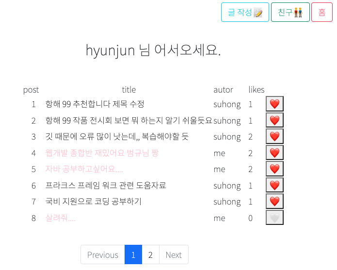
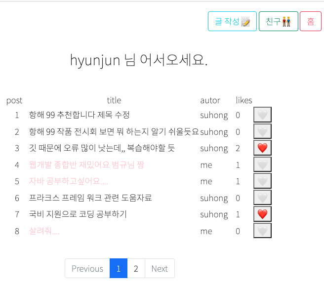
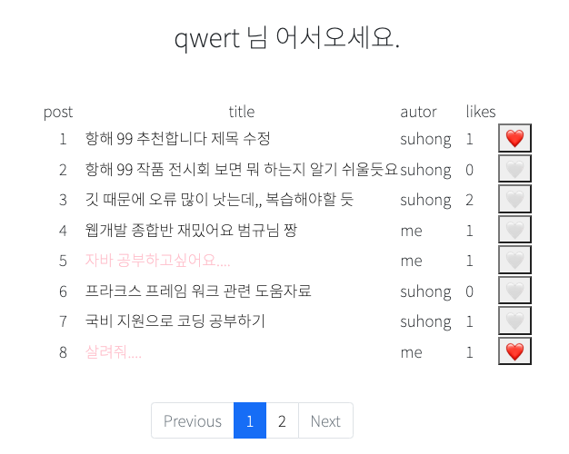
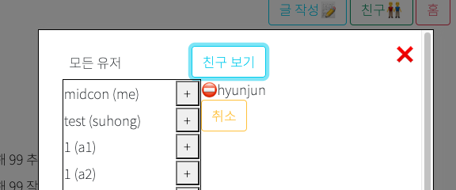
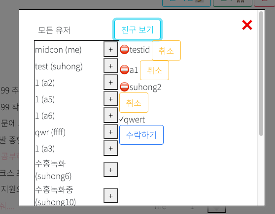
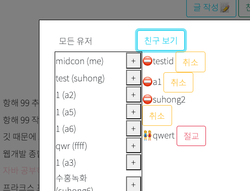

          개발 환경 
          - 2021, 맥북 프로 M1 Pro 14인치 모델  
          - Ventura 13.1

          버전 
          Python 3.9 
          Flask 2.2.2 
          PyCharm 2022.2.3 (Professional Edition) 
          

 

# 5일간에 걸친 프로젝트 완성!

## 엄청난 버그 
프로젝트 발표 전까지도 버그가 많이 있었습니다...   
깃을 통한 버전 관리도 깃허브로 하고 있었는데 사실, 각자의 브랜치에서 대부분 작업을 하고,

마지막에 합쳐서 충돌도 몇 군데 나기도 했고,  
마지막에 서버에 올리면서 url 경로 문제도 꽤 있었습니다. ㅜㅜ

그리고 crud 게시판 기능에.. delete가 없어서 마지막에 추가했는데

좋아요 기능이 잘 동작하지 않아.. 좋아요에 시간을 너무 들인 나머지..  
삭제 기능은 없애버렸습니다..

## git
그래도 브랜치 관리와 풀 리퀘스트 등 깃 관련해서 많이 배우게 되었고,  
앞으로도 남은 항해 과정에서의 협업은 잘 이루어질 것 같습니다!!

특히 컨플릭트 관련 수정할 때 조심해야 한다는 것을 배웠고..  
깃 이력을 보며 순서가 어떻게 진행되는지 공부도 많이 한 것 같습니다.

이제 자바와 주특기인 스프링을 공부해야 하는데  
하기 전 자바 기초와, 깃 관리에 대해서 정리 포스팅해 봐야겠습니다.

## 프로젝트 간단 시연

원래의 제가 맡은 역할은, 페이지 네이션(글목록 보여주기), 좋아요, 친구 기능이었고  
대략 아래처럼 구현해 보았습니다.

이런 식으로 페이지 네이션(메인페이지)을 만들었고,

글의 개수는 8개로 제한했고 페이지가 6을 안 넘어갈 경우 Previous는 클릭 되지 않고,  
페이지가 6을 못 채울 경우(5) Next가 클릭되지 않게 만들었습니다.

likes의 경우 하트에 따라 잘 작동함.

다른 유저의 경우

친구 기능 같은 경우  
qwert 유저가 -> hyunjun 유저에게 왼쪽 창에서 친구를 걸 경우

hyunjun 유저에게 오른쪽 창에 수락하기가 뜨고

친구를 받으면 이렇게 바뀐다.

## 얻어 간 것
이번 풀스택 프로젝트에서 내가 얻어 간 것은?
- 깃을 통한 협업하는 방법.
- 커뮤니케이션 방법
- 구글링 실력...
- jinja2
- 플라스크
- mongo db

등을 얻어 간 것 같고, 시간이 날 때 한 번씩 정리해 봐야겠다.  
이제는 자바와 스프링을 위해 공부해야겠다!