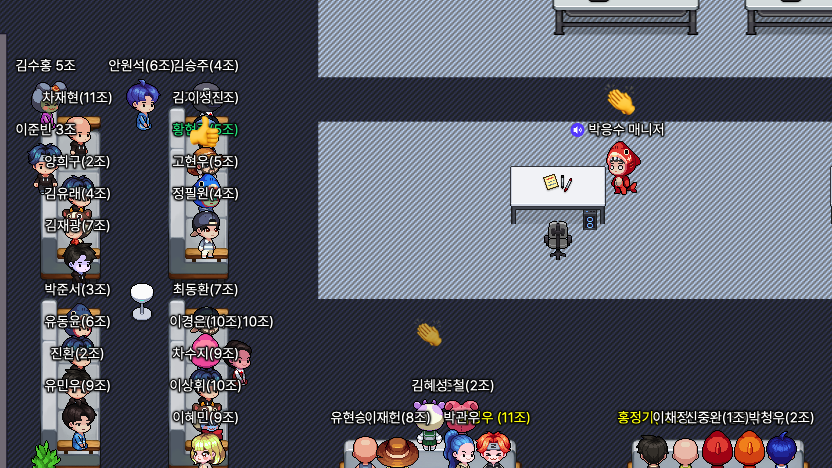
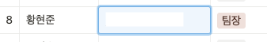

# 2-0 주차 언어 기본기 주차
프로그래밍 기초와, 주특기(스프링)을 배우기 전,  
짤막하고, 빡...세게 언어 기본기인 자바를 배울 시간 2일을 준다.

오전 9시 언어 기본기 주차의 발제가 이루어졌고,  

짧은 시간 동안 프로젝트를 같이했던 5조를 떠나 이번에는  
8조에 팀장으로 바뀌었다.  

아마 실력은 안되지만, 팀원들과 커뮤니케이션을 나름 하려고 노력해서?  
또 시켜주신 것 같다.

## 자바 공부 시작.
자.. 이제 2일이라는 시간 동안 자바라는 언어를 공부해야 한다..  
혼자 공부하는 자바라는 책을 항해에서 받게 되었고,  

교재가 670 페이지... 정도 되는데 자바에 관하여 아주 세세한 부분까지 설명이 잘되어 있다.  

정말 몰랐던 부분까지 알게 될 정도로 세세하게 잘 나와있다.

항해에서는 2일간 chapter5, 210page +알파까지 보면서 익히도록 권장(필수) 하고 있지만, 

나는 2일 동안 이 책 670페이지를 다 읽어 보려고 한다!!!

그리고 해당 서적에는 윈도우 - 이클립스 - 자바11 환경으로 진행하는 것 같은데  
맥에서는 이상하게 이클립스에서 한글이 지워지는 현상이 발생하여, 검색해 본 결과  
단순 인코딩이나 설정 문제가 아니고 따로 앱을 받고 해야 해서, 

그냥 인텔리 제이 쓰기로 했습니다...  
맥에서의 인텔리 제이 단축키를 많이 공부해야겠습니다.  
[IntelliJ 단축키 정리 블로그](https://gmlwjd9405.github.io/2019/05/21/intellij-shortkey.html)

사실 인텔리 제이는 웬만한 건 지정 단어 입력 시 자동완성을 바로 띄워주므로 너무 편리한 것 같습니다.

sout -> System.out.println();  
main, psvm 등등

그리고 잔디도 채울 겸.. 자바 실습 폴더를 깃레파지토리에 연결했습니다.    
깃이 생각보다 편하고? 필수라는 것을 알고 깃도 많이 사용해 보려고 합니다.

## 항해99의 큰 그림
사실 초반 항해의 커리큘럼은 파이썬의 플라스크, Mongo DB로 구성되어 진행됐습니다.  
사실 그때는 빨리 자바가 배우고 싶고 했지만, 지금 돌이켜보면

왜 초반에 파이썬으로 간편하게(그나마..) 웹 사이클을 공부할 수 있게 돌렸는지 알 것 같습니다.  

확실이 타입이라든지 문법이라든지 조금은 간편한 파이썬에서 빨리빨리 기능들을 조금이라도 익히게 되니

자바에서는 조금 익숙한? 느낌이 들어 크게 부담스럽게 다가오지 않았습니다.  
if abc :  -> if(abc){} 로만 바뀌고, 기능 자체는 똑같으니 프로그래밍에는 문제없음.

## 마무리
결국 오늘은 267페이지까지 책을 보며 공부하였고, 사실상 발제와 팀 편성으로 조금 늦게 시작한 부분과,  

앞 시간에 깃 관련 블로그 글 정리를 하느라 시간을 살짝 허비해서 아마 내일은 670페이지를 다 볼 수 있지 않을까 싶습니다.

오늘 이 책을 읽으면서 한 가지 정리를 해보고, 깨달았던 부분은 변수에는 프리미티브 타입과 레퍼런스 타입이 있고,

프리미티브 타입은 String 제외, int, char, double 등 기본 메모리 스택 영역에 LIFO 순서로 쌓여서 실제 값을 저장하게 되고,

레퍼런스 타입은 힙 영역에 실제 객체가 생기고, 스택 영역에 변수에는 그 객체의 주소만 참조한다는 것이라는 것을 배웠습니다.

사실 어느 정도 알고는 있었지만, 세세하게 다시 복습하게 되니 좋았던 것 같습니다.
