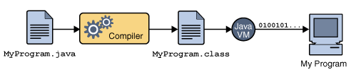

항해99를 시작한 지 2주가 되어간다. 

이번 주는 첫 풀스택 프로젝트가 끝나고 2일간의 언어 기본기(자바) 주 차를 보내고,  
프로그래밍 기초 주 차가 시작되었다.

## 풀스택 미니 프로젝트
깃허브, 노션, 깃 관리 등 협업에 관한 전반적인 내용을 익혔고,  

앞으로도 있을 협업에 대비해 많은 것을 공부하고 배운 것 같아 많은 것을 얻어 가는 주 차였다.

내게 아쉬웠던 점은 프로젝트를 기능적으로 구현하는 것에 대해 집중해 UI 적으로  
신경을 많이 못 쓴 것 같아 아쉬웠다.

## 언어 기본기 주 차
언어 기본기 공부 주 차에서는  
자바에 대한 전반적인 내용들을 알아가서 좋았던 주 차였고,

JVM, 객체지향, 익명 클래스, 컬렉션 프레임워크 등  
좋은 내용들을 알아간 것 같아 좋았고,

이게 단시간에 배운다고 해서 되는 게 아닌 계속 공부하고   
익혀야 될 것 같다.

## 프로그래밍 기초 주 차
프로그래밍 기초 주 차에서는, 반복문, 배열, 컬렉션 프레임워크 등을 이용해서   
어떠한 문제에 대한 해결 방안을 어떻게 구현할 것인가에 대해서 많이 공부가 된 것 같다.

처음에는 굳이 알고리즘 풀이를 해야 하나?라고 생각했지만,  

여러 가지 문제들을 풀다 보면, 나중에 웹 개발 시에도 분명 도움이 될 것 같은
생각이 들었다.

사실 코딩 테스트는 많이 안 해봐서 익숙하지 않아 초반에 조금 어려웠지만,

하다 보니 나오는 문제가 비슷비슷한 것 같아 많이 풀어보는 게 답인 것 같다.    
이번 2주 차 WIL의 키워드는 자바 공부를 조금이라도 하면서 중요한 부분이었던

* 객체지향 프로그래밍과, JVM이다.
  

## 객체지향 프로그래밍 (Object Oriented Programming)
프로그램 설계 방법론이자 개념의 일종!  

프로그램을 수많은 객체(object)라는 기본 단위로 나누고 이들의 상호작용으로 서술하는 방식.

객체란 하나의 동작을 수행하는 메소드와 정보를 표현하는 변수(필드)의 묶음으로 봐야 한다. 

객체지향은 특정한 언어를 지칭하는 게 아닌 개념이다!

장점
- 코드 재사용이 용이하다.
- 유지 보수가 용이하다.
- 클래스 단위로 모듈화시켜 개발 가능하므로 대형 프로젝트처럼 여러 사람이 프로젝트를 할 때 
업무 분담하기 쉽다.

단점
- 처리 속도가 상대적으로 느리다.
- 객체가 많으면 용량이 커질 수 있다.
- 객체지향으로 설계하려면 설계 전 확실한 기획이 필요하다.

객체지향 프로그래밍 키워드 
- 클래스 + 인스턴스(객체)
- 추상화
- 캡슐화(정보 은닉)
- 상속성
- 다형성

[객체지향 자세한 포스팅](https://hyunjunhwang1994.github.io/java/Java13/)

## JVM (Java Virtual Machine)
JVM은 다른 프로그램을 실행시키는 것이 목적인 프로그램이다.  
자바 프로그램이 어느 기기, 어느 운영체제에서라도 실행될 수 있게 하는 것이 JVM이 있는 이유이다.

OS에 종속 받지 않고 자바로 개발한 프로그램이 실행되기 위해서는 OS 위에서 Java를 실행시킬 무언가가 필요하다.  

이것이 바로 JVM이다.

Java 소스코드(*.java)는 CPU가 인식을 하지 못하므로 기계어로 컴파일을 해줘야 하는데, 

Java는 JVM이라는 가상머신을 거쳐서 OS에 도달하기 때문에 OS가 인식할 수 있는 기계어로 바로 컴파일 되는 게 아니라. 

JVM이 인식할 수 있는 Java byte code(*.class)로 변환된다

Java compiler가 .java 파일을 .class라는 Java bytecode로 변환한다.

변환된 bytecode는 기계어가 아니기 때문에 os에서 바로 실행되지 않는다.  
이때, JVM이 OS가 bytecode를 이해할 수 있도록 해석해 준다.

따라서 Bytecode는 JVM 위에서 OS 상관없이 실행될 수 있는 것이다.

-> 개발자는 소스코드만 잘 작성하면  
-> JVM 위에서 개발자가 만든 코드가 돌아가므로,  
-> 어떤 OS가 생기고, 없어지던 해당 OS에 맞는 JVM만 나오면  
-> 자바로 만들어진 코드는 전부 동작한다.