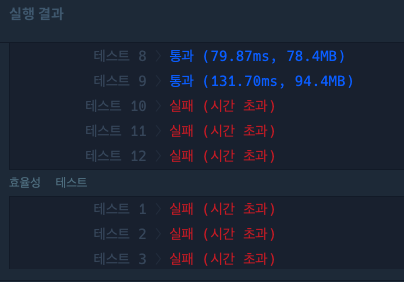
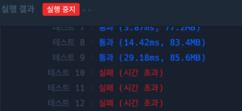
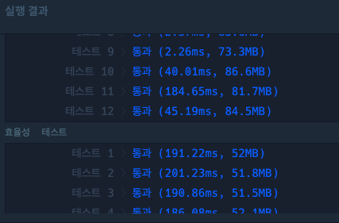

## 유..클리드 호제법?

오늘은 최대공약수와 최소공배수에서 유클리드 호제법이란걸 이용해서 풀어보았다..

[최대공약수와 최소공배수](https://school.programmers.co.kr/learn/courses/30/lessons/12940)


## 생각해 봐야 할 효율성 문제

[소수 찾기](https://school.programmers.co.kr/learn/courses/30/lessons/12921)


1~n까지의 소수의 개수를 반환하는 문제이다.

1은 제외하고 2부터 시작하여 n까지 모두 나누어서  
나누어떨어지는 게 자기 자신(count == 1)이라면 소수로  
판별하게 만들어놨는데.. 내가 생각해 봐도 너무 무식한 방법 같다..

```java
 public static int solution(int n){
        int answer = 0;
        int count = 0;

        for(int i = 2; i <= n; i++){
            count = 0;

            for(int j = 2; j<=i; j++){

                if(i % j == 0){
                    count++;
                }
            }
            if(count == 1){
                answer++;
            }

        }

        return answer;
    }
```


역시나 효율성에서 통과를 하지 못했다.



생각을 해보았다. 지금 위의 코드는 1제외 모든 수를 나누어 소수인지 판단한다..

그렇다면 1. 소수가 아니라면 (count == 2) 바로 반복문 중지라는 로직을 넣어보기로 했다.
아래처럼 작성했다.

```java
  public static int solution(int n){
        int answer = 0;
        int count = 0;

        for(int i = 2; i <= n; i++){

            count = 0;

            for(int j = 2; j<=i; j++){

                if(i % j == 0){
                    count++;
                }

                if(count == 2){
                    break;
                }

            }
            if(count == 1){
                answer++;
            }


        }


        return answer;
    }
```


수치상 많이 개선된 걸로 보이나 효율성 통과가 안되어 다른 방법을 생각해 보았다.



그래서 고민하던 중 문제 의도가 이렇게 다 돌려보는 게 아닌
특정 공식을 이용해서 풀어야 하는? 그런 의도로 보여서

다음 글을 참조했다.
[참조한 글](https://school.programmers.co.kr/questions/21359)

일단 제일 쉬워 보이는..
2를 제외한 짝수는 소수가 아니라는 것에 의거하여
코드에 적용해 보기로 하였다.

```java
public static int solution(int n){
        int answer = 0;
        int count = 0;

        for(int i = 2; i <= n; i++){

            count = 0;

            if((i != 2) && (i % 2 == 0)){
                System.out.println("짝수입니다 : " + i);
                continue;
            }


                for(int j = 2; j<=i; j++){

                    if(i % j == 0){
                        count++;
                    }

                    if(count == 2){
                        break;
                    }

                }
                if(count == 1){
                    answer++;
                }

            }

        return answer;
    }
```

위처럼 작성했는데도 오히려 효율성이 더 나빠진 것 같아


홀수만 일일이 돌리는 방법을 포기하고

제곱근을 이용하여 다시 풀어보았다.

[참조 블로그](https://velog.io/@changhee09/%EC%95%8C%EA%B3%A0%EB%A6%AC%EC%A6%98-%EC%86%8C%EC%88%98%EC%9D%98-%ED%8C%90%EB%B3%84-%EC%97%90%EB%9D%BC%ED%86%A0%EC%8A%A4%ED%85%8C%EB%84%A4%EC%8A%A4%EC%9D%98-%EC%B2%B4)

제곱근까지 나누어 봤을 때 나누어떨어지는 수가 있다면 소수가 아니다!
그래서 아래처럼 제곱근까지만 나누어보는 것으로 풀어봤습니다.
```java
 public static int solution(int n){
        int answer = 0;
        int count = 0;

        for(int i = 2; i <= n; i++){

            count = 0;

            if((i != 2) && (i % 2 == 0)){
                continue;
            }

            for(int j = 2; j<=Math.sqrt(i); j++){

                if(i % j == 0){
                    count++;
                    break;
                }

            }

            if(count >= 1){
                System.out.println(i+"는 소수가 아닙니다");
            }else{
                System.out.println(i+"는 소수 입니다.");
                answer++;
            }


        }

        return answer;
    }
```


통과되었다!!


과정
1. 모든 수를 일일이 나눠봄. -> 느림
2. 짝수를 제외하고 나눠봄 -> 그래도 느림
3. 해당 수의 제곱근까지만 나눠봄 -> 빨라짐


자바에서의 자료구조인 어레이 리스트, 해쉬맵등에대해서 공부했다.