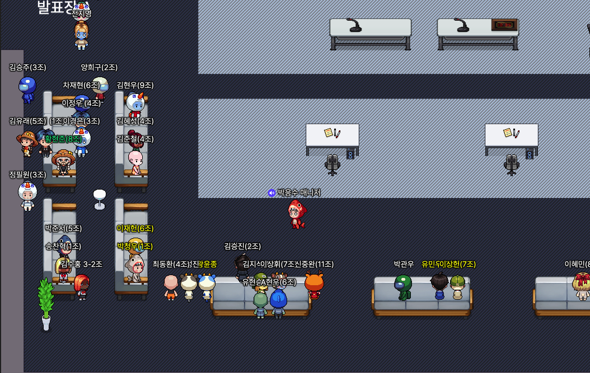
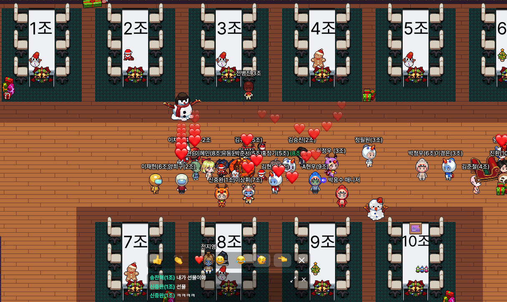
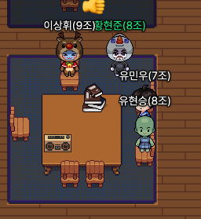

오늘은 주특기 입문 주 차 발제가 있었다.

스프링을 배우기 앞서 전반적인 내용과 조언, 스케줄, 팀 배정 등이 이루어졌고,

주특기(스프링) 입문 주 차는, 일주일 동안 진행된다.




발표실에서 나와 스터디룸에 와보니 

크리스마스를 맞이하여 스터디룸이 예쁘게 꾸며져있다..
(크리스마스 때도 공부하라는 무언의 압박인가요ㅠㅠ)





# 계획

이제부터는 스프링을 위한 기초과정으로 Http protocol, 자바 객체지향, 스프링, RDBMS 등을 배우고,

난이도도 있고, 이론적인 부분도 많고 심지어 배웠던 내용들을 내 것으로 확실히 만들어야 하기 때문에

확실히 스케줄을 잡고 집중해서 진행해야 할 거 같다.


## 객체지향 객체 모델링 연습

본격적으로 스프링을 공부하기 전 S.A 과제로
객체 모델링을 연습해 보는 과정이 있었다.
자바의 객체지향을 업그레이드하기 위한 대중교통 객체지향 만들기 문제를 풀었다.

강의자료 일지도 몰라서 올리진 못하지만,
추상 클래스, 오버라이딩, 인터페이스, 상속 등을 이용해

상속관계에 있는 객체 모델링을 연습하는 문제였다.

일단 열심히 해서 풀고, 시간이 조금 남아

7시에 있을 자바 언어 스터디 모임을 위해
자바의 객체지향 관련 포스팅을 하고, SOLID 원칙을 공부 하였다.
(포스팅..)


저녁 7시 자바 언어스터디 모임을 가졌다.



객체지향에 있어서
자바의 클래스, 필드, 생성자, 메소드, 인스턴스, 접근제한자 등에 있어서 
한 팀원이 정리해온 내용을 프레젠테이션 발표로 듣고, 

나머지팀원은 궁금한 점이나, 만약. 면접관이라면 어떤 질문을던질까? 라는 
느낌으로 질문을 하면서 스터디 진행을 했다.

다음주 금요일은 내가 상속, 다형성(타입변환),추상클래스에 관해서 발표를 할차례다..


그리고 진행 도중 알고리즘 문제 매일 풀기라는 팀에 어찌하여 끼게 되었고,

피보나치 수
https://school.programmers.co.kr/learn/courses/30/lessons/12945

올바른 괄호
https://school.programmers.co.kr/learn/courses/30/lessons/12909?language=java

라는 문제를 내일까지 풀기로했다.

오늘은 일단 피보나치 수 까지만.. 풀어 보려고 한다.

어쩌다가 됬다.. 피보나치 수를 구현하고 1234567의 나머지를 구하는 과정에서
오버플로우를 고치느라 시간이 좀 걸렸다.

```java

    public int solution(int n){
        int answer = 0;

        int n0 = 1;
        int n1 = 1;

        for(int i = 2; i<n; i++){

            answer = (n0 + n1) % 1234567;
            n0 = n1;
            n1 = answer;

        }


        return answer;
    }
```