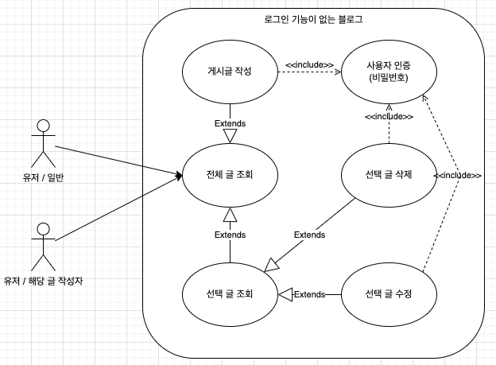
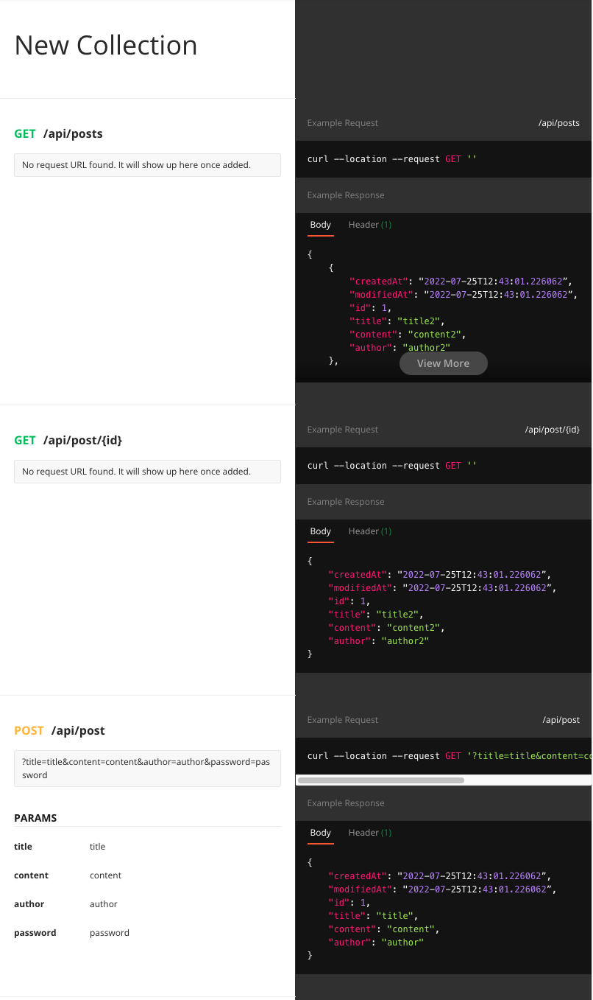
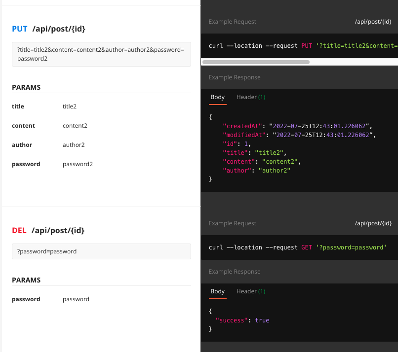

오늘은 스프링에 익숙해지는 겸 개인 과제를 진행하면서  
스프링 아키텍처를 이해하는 시간을 가졌습니다.

오늘 SQL 관련 강의가 지급되어서 내일은 DB 쪽으로 공부 좀 해보려고 합니다.

일단 과제를 하기 전, 강의들을 보며 Controller, Dto, Entity, Service, Repository을 이용해서  

H2 데이터베이스에 접근하여 방법들을 먼저 공부해 봤습니다.

[스프링 아키텍처](https://hyunjunhwang1994.github.io/spring/Spring4/)


# CRUD 게시판 (블로그) 기획하기
과제 요구 사항 중 기획하는 부분이 꽤 중요한 부분 같아서, 기획도 시간을 많이 들여서 해봤다.

일단 Use Case, API 명세가 과제 요구사항이었고 과제 진행전 아래처럼 기획해 보았다.

여러 가지 툴을 이용하여 기획을 하는 부분이 힘들었지만, 나중에 협업에 있어서도 매우 중요한 부분이라고
생각하기 때문에, 시간을 많이 들여 진행했다.


## Use Case Diagram
유스 케이스 다이어그램 같은 경우 시스템에서 제공해야 하는 기능이나 서비스를 명세한 다이어그램이다.

툴은 무료 버전 중 괜찮은 아래의 웹툴을 깃허브랑 연결하여 사용하였다.  
[UseCaseTool](https://app.diagrams.net/)




## API 명세서
협업할 때 매우 중요하고,  
API 명세서를 잘 기획하고 작업을 해야 작업시간이 단축된다.  

무슨 기능이 있는지, 파라미터는 무엇을 사용해야 하는지 등의 API에 대한 명세를 기록한 것이다.

Postman이라는 앱으로 사용하여 아래처럼 기획해 보았습니다.







ERD의 경우 과제 요구사항이 아니기 때문에 기획하지 않았고,  

인텔리제이에서 다이어그램을 볼 수 있기 때문에, 인텔리제이를 잘 활용해서 사용해 보려고 한다.


## 어려웠던 점

오늘 작업 진행 중, 조금 헤매었던 점?  
해당 글의 링크(제목) 클릭 시 -> 해당 글의 자세한 내용을 표시하는 로직이 있는데

전체 글 리스팅 페이지에서 -> 선택 글 페이지로 뷰가 바뀌기 때문에

Rest Controller에서 처리해온 DTO 객체를 반환할 건데  
이걸 Rest Controller인데 어떻게 넘기지?라고 고민했고,

얼마 전 봤던 강의에서 RestController에서 ModelAndView로 뷰를 뿌린 것이 생각나서  
아래처럼 적용해 보았다.

```java
@GetMapping("/api/post/{id}")
    public ModelAndView readPost(@PathVariable Long id) {

        ModelAndView modelAndView = new ModelAndView();
        modelAndView.setViewName("post");
        modelAndView.addObject(postService.readPost(id));

        return modelAndView;

    }
```

<br>

그다음은.. 넘어온 모델 데이터 안에 든 값들을

처음엔 ${post.contents}로 써야 하나? 해서 안되길래..  
thymeleaf 템플릿 엔진은 문법이 다르겠지 하고 찾아보았다.

thymeleaf 템플릿 엔진은 jinja2에서처럼 ${post.title} 방식은 안되고
아래와 같은 방식으로 해야 된다는 걸 알았다.

${id}는 @PathVariable 값이다.

```html
<span th:text="${post.id}"></span>
<span th:text="${id}"></span>

[[${post.title}]]
[[${post.contents}]]
[[${post.author}]]
```

