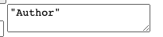

오늘은 CRUD 게시판 과제 진행 중  
HTML, 자바스크립트에 thymeleaf 사용 시 잘 안되는 것 같아서 공부를 좀 했습니다.

오늘은 헤맨 부분이 꽤 있어서 TIL을 쓸 거리는 좀 있겠구나... 했습니다.


### CDATA?
처음에 자바스크립트에서 생각대로 Thymeleaf가 잘되지 않아서,
검색해 보니 CDATA?라는 것을 적용해야 한다고 해서

더 알아보니 thymeleaf 3.0버전 부는 자바스크립트에 CDATA를 안 써도 된다고 하더라고요.


### Delete 기능

Delete 기능을 구현하던 중 
RestController 한 개만으로 코드를 작성하고 있어서,  

뷰를 같이 넘기고 싶어서, 모델엔 뷰를 계속 리턴하고 있었는데 
 

```java
 @DeleteMapping("/api/post/{id}")
    public ModelAndView deletePost(@PathVariable Long id, @RequestBody PostRequestDto requestDto) {


        ModelAndView modelAndView = new ModelAndView();
        modelAndView.setViewName("index");

        boolean result = postService.deletePost(id, requestDto.getPassword());


        HashMap<String, Boolean> jsonReturn = new HashMap<>();
        if(result == true){


            jsonReturn.put("success", true);
        }else{
            jsonReturn.put("success", false);
        }


        System.out.println(jsonReturn);

        modelAndView.addObject(jsonReturn);


        return modelAndView;
    }
```


위의 로직이 진행되면 Ajax가 결과를 받아 처리합니다.  
그런데 Ajax 부분 진행 중 Hashmap으로 받은 값을

자바스크립트에서 jsonReturn으로 받으려 해도 잘 안되더라고요.  
thymeleaf 문법을 다 써봐도 잘 안됐습니다.  
뭔가 타입이 안 맞다든지. 키값을 입력해도 밸류 값이 안 넘어온다든지..


```javascript
   function postDelete(){

                let password = $('#password').val();


                let data = {
                    'password' : password };

                $.ajax({
                    method: 'DELETE',
                    url: "/api/post/[[${post.id}]]",
                    contentType: "application/json",
                    data: JSON.stringify(data),
                    success: function (response) {


                        alert(jsonReturn);


                        alert('메시지가 성공적으로 삭제되었습니다.');
                        window.location.href="/";
                    }
                });
        }
```

컨트롤러에서 HashMap으로 넘겨주면 json이 된다고 하던데...
왜 안되는 거지 생각을 해보다가

생각해 보니 자바스크립트에서 리다이렉트를 해주고 있는데
굳이 모델엔 뷰로 뷰까지 넘겨야 하나 해서..


여기서 더 생각을 해보니 요청한 것은 Ajax 비동기 방식이고,  
자바스크립트 코드에서 리다이렉트를 해주고 있어서 ModelAndView를 쓸 필요가 없겠구나?라고 생각했습니다.

최대한 Restful하게 만들기도 해야 하고요.

그래서 아래의 코드처럼 JSON을 리턴해주기 위해  
결과값 데이터만 가지는 PostDeleteResultDto를 새로 만들어 사용했습니다.

```java
 @DeleteMapping("/api/post/{id}")
    public PostDeleteResultDto deletePost(@PathVariable Long id, @RequestBody PostRequestDto requestDto) {


        boolean result = postService.deletePost(id, requestDto.getPassword());

        if(result == true){


            return new PostDeleteResultDto(true);
        }else{
            return new PostDeleteResultDto(false);
        }

    }
```


```java
@Getter
@Setter
@AllArgsConstructor
public class PostDeleteResultDto {

  boolean result;


}
```

```javascript
function postDelete(){

                let password = $('#password').val();


                let data = {
                    'password' : password };

                $.ajax({
                    method: 'DELETE',
                    url: "/api/post/[[${post.id}]]",
                    contentType: "application/json",
                    data: JSON.stringify(data),
                    success: function (response) {

                        result = response["result"]


                        if (result == true) {

                            alert('포스트가 성공적으로 삭제되었습니다.');
                            window.location.href="/";

                        }else{
                            alert('비밀번호가 다릅니다.');
                        }


                    }
                });
        }

```


### 또 헤매었던 부분

```html
<input type="text" id="title" name="title" value=[[${post.title}]] placeholder="title" >
<input type="text" id="author" name="author" value=[[${post.author}]] placeholder="author" >
<textarea class="field" name="contents" th:text=[[${post.title}]]>[[${post.author}]]</textarea>

```

일단 위의 thymeleaf 값들은 일반 HTML 태그 안 데이터로 불러오면 다 잘 불러와집니다.

근데 저위의 input과 textarea가 있는 상태에서 input 값들은 잘 되는데 


textarea의 경우 태그 안의 데이터로 넣으면,
쌍따옴표 "" 가 표기되어 나오고,




찾아보니 th:text로 쓰라고 해서 쓰는데, 동작 자체를 안 합니다. 

렌더링 시점 차이인지는 모르겠지만
[[${post.author}]]는 데이터가 출력되지만 ""가 포함되어 값이 나오고  

th:text=[[${post.title}]]   ,  th:text=${post.title}
는 아예 빈값으로 나와서,

어떻게 해결해야 할까 생각을 해보다가?


그리고 어제의 TIL 글에서,  
${}와, [[${}]]가 버전에 따라 다른 것 같다고 말한 것 같은데

아니었습니다.... 

중괄호, 대괄호의  차이를 아랫글을 보고 알았습니다...  
[Thymeleaf 문법](https://maenco.tistory.com/entry/Thymeleaf-Text-Escape-%ED%85%8D%EC%8A%A4%ED%8A%B8-%ED%91%9C%ED%98%84-%EC%9D%B4%EC%8A%A4%EC%BC%80%EC%9D%B4%ED%94%84)


그리고 헤맨 김에 더 공부를 해보니

```javascript
 <script th:inline="javascript">
```

무조건 해야 하는 줄 알았던 위의 inline 설정 때문에 자동 따옴표가 생기는 것이었고  

이 기능 자체는 편의성을 위한 것 같지만 이것을 해제하여 잘 동작하길래 위의 inline 설정 제거 후 아래처럼 사용하였습니다


```html
<input type="text" id="title" name="title" value=[[${post.title}]] placeholder="title" >
<input type="text" id="author" name="author" value=[[${post.author}]] placeholder="author" >
<textarea id="contents" >[[${post.contents}]]</textarea>
<button onclick="postUpdateRequest()">글 수정 완료</button>
```


그러고는 SQL 공부 및 정리와, 자바 언어 스터디를 위한 자바의 상속 및 다형성에 대해서 정리를 했습니다.
