# 자바의 상속과 다형성에 대해서 정리를했따
[링크]()


# Spring Architecture, DTO, Entity

어제 완성한 기존의 코드의 경우 서비스단에서 처리한 Entity 객체가 뷰(HTML페이지..)까지 넘어 가는 형태로 작성을 했는데.

Entity객체는 실제 DB테이블과 매핑되는 핵심 클래스 이면서,  
테이블이 가지는 컬럼들이 필드로 가지기 때문에

보안상의 이유로

단순 데이터 그 자체만 가지고 전달되는 객체인 DTO객체로 변경해보려고 한다.


## 요구사항 (현재 CRUD 게시판 과제 진행중)
- 현재 엔티티상에는 Password 컬럼(필드)이 포함되어 있다.
- 서비스단에서 해당 선택글 데이터를 가지고 올때, Entity에 존재하는 컬럼인 Password 필드는 필요가 없다. (있을 시 위험.)
- 컨트롤러 단에서 Entity가 아닌 DTO만을 처리하게 해라.


<details>   
<summary>기존 선택 글 가져오기 코드</summary>
<div markdown="1">    

```java

// RestController
@RestController


     // 선택 글 조회
    @GetMapping("/api/post/{id}")
    public ModelAndView readPost(@PathVariable Long id) {

        ModelAndView modelAndView = new ModelAndView();
        modelAndView.setViewName("post");
        modelAndView.addObject(postService.readPost(id));

        return modelAndView;

    }


// Service
@Transactional(readOnly = true)
    public Post readPost(Long id) {

        Post post = postRepository.findById(id).orElseThrow(
                () -> new IllegalArgumentException("해당 글이 존재하지 않습니다.")
        );

        return post;
    }

// Repository
public interface PostRepository extends JpaRepository<Post, Long> {

        .......

}

// DTO
@Getter
public class PostRequestDto {

    private String title;
    private String contents;
    private String author;

    private String password;


}


// Entity
@Getter
@Entity
@NoArgsConstructor
public class Post extends Timestamped {


    @Id
    @GeneratedValue(strategy = GenerationType.AUTO)
    private Long id;

    @Column(nullable = false)
    private String title;


    @Column(length = 50000, nullable = false)
    private String contents;

    @Column(nullable = false)
    private String author;

    @Column(nullable = false)
    private String password;

    public Post(PostRequestDto requestDto) {

        this.title = requestDto.getTitle();
        this.contents = requestDto.getContents();
        this.author = requestDto.getAuthor();
        this.password = requestDto.getPassword();
    }

    public void updatePost(PostRequestDto requestDto) {
        this.title = requestDto.getTitle();
        this.contents = requestDto.getContents();
        this.author = requestDto.getAuthor();
    }

}
```
```html
<!-- post.html -->

<div id="postMeta">
    <span>제목 : [[${post.title}]]</span>
    <span>작성자 : [[${post.author}]]</span>
</div>

```


</div>
</details>

            
<br>


TODO:
1. Service단에서 Entity를 DTO로 변환하여 컨트롤러로 넘겨줘야함.
2. DTO에는 Password 필드가 존재하지 않아야함.

          


## Dto생성

password 필드만 제외한 선택 글을 뿌려주기위한 용도의 DTO를 만들었다.


<details>  
<summary>SelectPostShowDto</summary>
<div markdown="1">             

```java
@Getter
@Setter
public class SelectPostShowDto {
    private String title;
    private String contents;
    private String author;

}

```
            

</div>
</details>


## Service 계층 코드 수정
서비스 단에서 부터 리턴을 DTO로 하기위해 return 타입과, 로직을 변경하였다.

<details>  
<summary>PostService</summary>
<div markdown="1">             

```java
@Service


    @Transactional(readOnly = true)
    public SelectPostShowDto readPost(Long id) {

        SelectPostShowDto selectPostShowDto = new SelectPostShowDto();

        Post post = postRepository.findById(id).orElseThrow(
                () -> new IllegalArgumentException("해당 글이 존재하지 않습니다.")
        );

        selectPostShowDto.setTitle(post.getTitle());
        selectPostShowDto.setAuthor(post.getAuthor());
        selectPostShowDto.setContents(post.getContents());


        return selectPostShowDto;
    }

```
            

</div>
</details>


## 삽질 시작!
위의 코드까지 진행 시 사실 html페이지의 템플릿엔진 부분만 살짝 바꿔주면 동작을 해야할 것 같다.

그런데, post.html에서  

기존 Entity의  [[${post.id}]] 를  
DTO의         [[${SelectPostShowDto.title}]] 식으로 바꾸었더니 에러가 났다.


개발자 도구 확인시 500에러 발생으로 서버쪽 에러가 확인됬다.  
타임리프자체가 서버렌더링이므로 서버쪽에러는 맞는 것 같고.

원래의 코드는 service단에서 post라는 이름으로 뷰단까지 넘어왔었는데  
현재는 selectPostShowDto라는 이름으로 바꾸어놓아서  
html페이지의 이름도 바꾸었는데 에러가 왜 날까?


- 일단 서비스단 자체는 문제가없을것으로 판단 컨트롤러단으로 넘어온 필드들의 데이터를 확인해보았다.
- 확인 중, 컨틑롤러 단에서 기존 서비스를 의존하는 코드에서 DTO를 의존하는 코드로 코드를 변경하였다.


<details>  
<summary>기존 컨트롤러, 변경 코드</summary>
<div markdown="1">   


```java
// 기존 코드
 @GetMapping("/api/post/{id}")
    public ModelAndView readPost(@PathVariable Long id) {

        ModelAndView modelAndView = new ModelAndView();
        modelAndView.setViewName("post");
        modelAndView.addObject(postService.readPost(id));
        
        System.out.println(postService.readPost(id).getAuthor());
        System.out.println(postService.readPost(id).getContents());
        System.out.println(postService.readPost(id).getTitle());
        
        return modelAndView;

    }


// 변경 코드
@GetMapping("/api/post/{id}")
    public ModelAndView readPost(@PathVariable Long id) {
        SelectPostShowDto selectPostShowDto = postService.readPost(id);

        ModelAndView modelAndView = new ModelAndView();
        modelAndView.setViewName("post");
        modelAndView.addObject(selectPostShowDto);

        System.out.println(selectPostShowDto.getAuthor());
        System.out.println(selectPostShowDto.getTitle());
        System.out.println(selectPostShowDto.getContents());

        return modelAndView;

    }
```
</div>
</details>


해보니, 컨트롤러 단까지 값은 아래와 같이 잘넘어온다.  
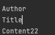

그렇다면 어느부분이 문제일까?

아마 DTO를 토대로 서버쪽에서 뷰페이지를 렌더링하는 과정에서 타임리프의 문제이지 않을까 싶다.

## 다음 단계 디버깅

컨트롤러에서 아래처럼 모델을 찍어보니
System.out.println( modelAndView.getModel());

아래와 같은 값이 나온다.
{selectPostShowDto=com.hyunjun.spring_basic_week_assignment.dto.SelectPostShowDto@25faa12f}

그렇다면 selectPostShowDto라는 이름으로 렌더링 되는게 맞을건데 왜안될까..?

post html에 관련코드가 많아 테스트가 어려워
새로 test html을 만들어 테스트를 해 보았다.

혹시나 기존방식이아닌 th:text 방식을 써보고자
아래처럼 해보았더니

```html
    <span th:text="${selectPostShowDto.title}">제목  </span>
    <span th:text="${selectPostShowDto.author}">작성자  </span>
    <span th:text="${selectPostShowDto.contents}">작성자  </span>
```

잘동작한다 ?


--> 기존[[${data}]] 방식의 경우 값 치환이 아닌 unescpae가 적용되어 직접 출력하는 것이고  
--> 바뀐 th:text="${data}" 의 경우 data안의 값을 이스케이프 처리하지않고 출력하는것인데

안되려면 두개다 안되어야되는데 뭔가 이상하다!

    [[${selectPostShowDto.title}]]
    [[${selectPostShowDto.author}]]
    [[${selectPostShowDto.contents}]]

도 test.html에 같이 넣어 테스트해보았더니 아래처럼 잘나온다.

두가지 방식 다 잘 통과한다. 과연 무슨문제일까?


## 로그를 잘 확인하자..

스프링의 로그를 확인해보니.
ajax 부분의 URL 부분에서 에러가난다.

원래코드는 이렇다.
 url: "/api/post/[[${post.id}]]",,

 바뀐 코드는.
  url: "/api/post/[[${selectPostShowDto.id}]]",


인데 타임리프가 잘동작하는걸 test.html에서 확인했는데 왜 저부분에서 에러가 날까 ?


아래처럼 타임리프도 회색으로나오고.

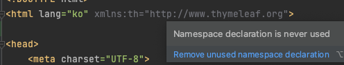

아마 현재 html페이지에서 타임리프를 사용하지 않는다는의미같은데..?

test.html 에는 잘되는 타임리프가  post.html으로오면안된다.?

합리적의심으로 일단 인텔리제이를 껏다켜보았따.

차이가없다.. 컴퓨터는 바보가아니다.. 분명 내가 뭔가 잘못했을것이다..


혹시나 싶어, 관련 ajax 내용 빼고 다지워보았다.

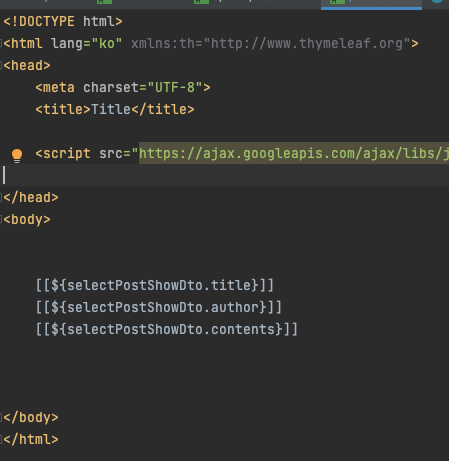

동작하네 ..?


아 URL을 넣는부분에 문제가 있구나..

post.id(Entity 버전에서 되던부분)과  
selectPostShowDto.id(현재 DTO버전에서 안되는 부분)가 무슨 차이가 있지 ??

하다가 문득 떠올랐다.. 에러가난 부분의 필드명이 id구나..?  
내가만든 dto안에는 id가 안들어있지..?

그래서 고민을해봤다..

기존의 로직은 Entity를 끌고다니므로 테이블에있는 key인 Id 와 매칭이되어  
뷰까지 끌고와서 사용을했었다.

그랬기에 테이블에있는 컬럼들은 자유롭게 사용이가능하지만
password라던지 중요정보를 같이 끌고올 위험이있다.

그래서 id 컬럼을 만들어 보기로 했다.

원래버전이 가능했던것은 기존로직에서는 응답 시 DTO자체를 사용하지 않았다는 말이 된다.
(DTO자체에 id필드가 없으니.)


사실 컨트롤러 API를 호출할 때 PathVariable으로  
id를 가지고 오므로, 이 id를 활용할까하다가, 사용자가 직접입력하거나 하는 부분에서  
취약점이 있을것같아 그방법으로 하지않고,


아래의 방법으로 했다.

## dto 필드 변경

그래서 dto에 id를 추가해주고  
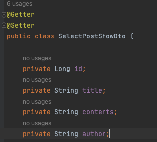

이런식으로 id도 담아주었다.  
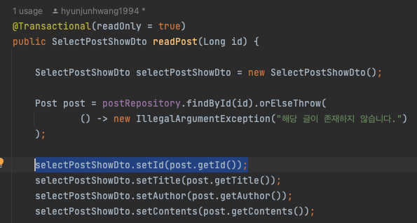

그랬더니 이제는 잘동작을한다!


## 로그, 익셉션 확인 잘 하자!!

중요한 부분은 사실 애초에 스프링에서띄워줬던 익셉션 부분만 곰곰히 생각해봤따면 

id라는 부분에서 에러가나네? 하고 금방해결할문제인데 기존 Entity로 사용했던 방식때문에,  

id는 있는데 왜없다고하는거지?라는 생각에

역으로 디버깅을 해보지않아도 될 시간을 좀 잡아먹은 것 같다.

## 더 나은 방식으로.
이렇게 진행을 해보니 이제는 다른 방식이 없나? 하고 다음과같은 생각이 들었다.

일단 DTO버전으로 수정한 방법처럼,  
구조만을 생각하고 DTO에 중점을 두고 기능을 만들어 보았기에  
더 쉽고, 좋고, 안전한 방법들을 생각해 보았다.

- Service -> 컨트롤러로 넘어올때 entity로 넘겨와서 DTO로 변환을 해도 될것같고

- DTO는 어느 계층까지 활용을하고
- DTO는 요청, 응답마다 따로만들어야 하나 ?  
    ㄴ 요청시에는 비밀번호가 있지만, 응답 시에는 비밀번호가 없다면?
- Entity는 어느 계층까지 와도 되나
- Entity값을 더 쉽게 넣을수없을까?

와 같은 생각이들었다.


[DTO용도, 갯수 관련 참조 글](https://okky.kr/articles/1202337)

## Entity -> DTO

아까 수정했던 Server계층에서 DTO에 Entity값을 넣는 과정에서  
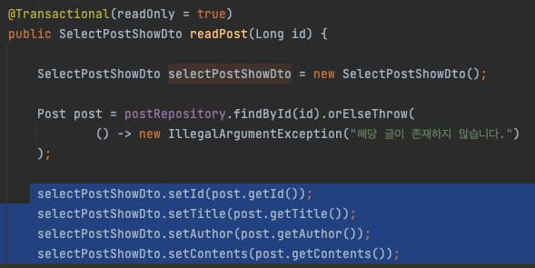

selectpostShowDto.set() 과정이 복잡해보여서 이것 관련  
어노테이션, 스프링기능 혹은 방법은없나? 하고 찾아보았다.  
(아무리 생각해도 편하게 쓰려고 쓰는 스프링에서 위와같이 쓸것같진않아서..)


지금까지는 DTO를 사용해야한다는 마음에 직접 삽질하여 내마음대로 해보았고,
이제는 스프링에서 쓰는방식, 다른사람들이 쓰는 방식대로 해보고 싶었다.


찾아보다가
Entity와 DTO간의 변환은 Controller, Servcie단에서 주로 한다고하여


내가했던 Entity값을 DTO에 일일이 담는 비효율 적인방법보다
Entity를 DTO랑 매칭해서 값을 넣어주는 라이브러리를 찾아서

일단은 service단에서 처리후 dto를 반환하는 코드를 바꿔보았다.

## ModelMapper
일단 난 그래들이므로 build.gradle에 아래의 디펜던시 의존성을 추가해줬다

        implementation group: 'org.modelmapper', name: 'modelmapper', version: '2.3.8'


그 후, ModelMapper의 임포트가 잘되지않아서 인텔리제이를 재 시작하니 임포트는 잘 되었다.


그 후 아래처럼 바꿨더니 잘동작한다!!( 주석은 원래 코드 )

```java
  @Transactional(readOnly = true)
    public SelectPostShowDto readPost(Long id) {

        //        SelectPostShowDto selectPostShowDto = new SelectPostShowDto();

        Post post = postRepository.findById(id).orElseThrow(
                () -> new IllegalArgumentException("해당 글이 존재하지 않습니다.")
        );
        //        selectPostShowDto.setId(post.getId());
        //        selectPostShowDto.setTitle(post.getTitle());
        //        selectPostShowDto.setAuthor(post.getAuthor());
        //        selectPostShowDto.setContents(post.getContents());


        ModelMapper modelMapper = new ModelMapper();
        SelectPostShowDto selectPostShowDto = modelMapper.map(post, SelectPostShowDto.class);


        return selectPostShowDto;
    }
```


[Model mapper](https://velog.io/@kimview/ModelMapper)

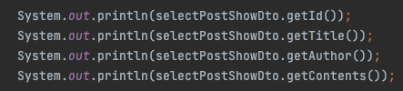
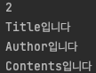


## Builder패턴과 toEntity

써칭을 하다가 아래 블로그에서 또 다른 방법을 발견하여  

글을 수정하는 API에 적용해 보려고한다!

정리가 잘되어있으니 참조하면 좋을 듯하다.
[참조 블로그](https://velog.io/@jsb100800/Spring-boot-DTO-Entity-%EA%B0%84-%EB%B3%80%ED%99%98-%EC%96%B4%EB%8A%90-Layer%EC%97%90%EC%84%9C-%ED%95%98%EB%8A%94%EA%B2%8C-%EC%A2%8B%EC%9D%84%EA%B9%8C)


### 선택한 글을 수정하기
DTO의 입장에서 먼저 확인해보겠습니다.

글 수정시 패스워드를 기준으로 글에대한 수정권한을 주므로,
password, title, contents, author 정도를 수정할수 있게 하려 합니다.

그럼 요청 시 DTO는
password, title, contents, author를 담게 만들고


응답같은경우 password를 제외한 

createdAt, modifiedAt, id, title, content, author를 가지는 dto를 따로 만들면 될 것 같네요!

사실 글 수정 성공시 해당 글id로 GET으로 보내주어서,
위의 응답 DTO는 만들 필요가 없지만,

확인하는 용도로 만들어볼게요!

+ 유연하게 사용할려면 현재 상황의 경우  
아마도 글 작성, 글 수정 의 서비스는 달라도 DTO는 똑같아도 될 것 같네요!
(물론 API 기능마다 DTO파일이 달라야 한다라는 룰이있다면 그렇게 쓰셔도 좋구요!)


### 시작!

<details>  
<summary>PostRequestDto</summary>
<div markdown="1">             

```java
@Getter
@NoArgsConstructor
public class PostRequestDto {

    private String title;
    private String contents;
    private String author;

    private String password;


    @Builder
    public PostRequestDto(String title, String contents, String author, String password) {
        this.title = title;
        this.contents = contents;
        this.author = author;
        this.password = password;
    }


    // dto -> entity
    public Post toEntity() {
        return Post.builder()
                .title(title)
                .contents(contents)
                .author(author)
                .password(password)
                .build();
    }

}
``` 

</div>
</details>

<details>  
<summary>PostResponseDto</summary>
<div markdown="1">             

```java
@Getter
@NoArgsConstructor
public class PostResponseDto {

    private Long id;
    private LocalDateTime createdAt;
    private LocalDateTime modifiedAt;
    private String title;
    private String contents;
    private String author;


    // entity -> dto
    public PostResponseDto(Post post) {
        this.id = post.getId();
        this.createdAt = post.getCreatedAt();
        this.modifiedAt = post.getModifiedAt();
        this.title = post.getTitle();
        this.contents = post.getContents();
        this.author = post.getAuthor();
    }

}
``` 

</div>
</details>


<details>  
<summary>PostService</summary>
<div markdown="1">             

```java
@Transactional
    public PostResponseDto updatePost(Long id, PostRequestDto requestDto) {

        // Entity <- DTO
        // Post post = requestDto.toEntity();


        // 해당 글과 글과 비밀번호가 매칭되는지 확인
        Post post = postRepository.findByIdAndPassword(id, requestDto.getPassword());


        // 매칭된다면
        if(post != null){
            // Dirty Checking을 이용하여 업데이트
            post.updatePost(requestDto);

            // DTO <- Entity
            PostResponseDto postResponseDto = new PostResponseDto(post);

            return postResponseDto;
        }else{
            return null;
        }
    }


``` 

</div>
</details>


<details>  
<summary>Post</summary>
<div markdown="1">

```java
@Getter
@Entity
@NoArgsConstructor
public class Post extends Timestamped {


    @Id
    @GeneratedValue(strategy = GenerationType.AUTO)
    private Long id;

    @Column(nullable = false)
    private String title;


    @Column(length = 50000, nullable = false)
    private String contents;

    @Column(nullable = false)
    private String author;

    @Column(nullable = false)
    private String password;


    @Builder
    public Post(Long id, String title, String contents, String author, String password) {
        this.id = id;
        this.title = title;
        this.contents = contents;
        this.author = author;
        this.password = password;
    }

    public Post(PostRequestDto requestDto) {

        this.title = requestDto.getTitle();
        this.contents = requestDto.getContents();
        this.author = requestDto.getAuthor();
        this.password = requestDto.getPassword();
    }

    public void updatePost(PostRequestDto requestDto) {
        this.title = requestDto.getTitle();
        this.contents = requestDto.getContents();
        this.author = requestDto.getAuthor();
    }


}
```

</div>
</details>


이때 엔티티의 만들어놓은 업데이트 메소드만으로 실제 업데이트 쿼리가 가능한이유?  
Dirty Chechking으로 인해 트랜잭션안에서 Entity의 변경이 일어나면,  
변경한 내용은 자동으로 DB에 반영(update)된다.

[변경 감지](https://velog.io/@koo8624/Spring-%EB%B3%80%EA%B2%BD-%EA%B0%90%EC%A7%80%EB%A5%BC-%ED%99%9C%EC%9A%A9%ED%95%9C-Entity-%EC%88%98%EC%A0%95)  
[Dirty Checking](https://jojoldu.tistory.com/415)  
[Dirty Chechking](https://jojoldu.tistory.com/536)  


<details>  
<summary>PostController</summary>
<div markdown="1">

```java
@RestController
@RequiredArgsConstructor


 @PutMapping("/api/post/{id}")
    public PostResponseDto updatePost(@PathVariable long id, @RequestBody PostRequestDto requestDto) {

        PostResponseDto postResponseDto = postService.updatePost(id, requestDto);


        return postResponseDto;
    }
```


</div>
</details>


### 마치며.
지금까지 봐온 DTO 계층 이동, Entity 계층 이동,
DTO의 용도, 파일구분 등은 사람,회사, 상황, 에 따라 다르며,

DTO를 아예 안써도 되고,
여러가지 상황을 DTO한개로 해결가능하다면 해도되고,
Entity로 뷰까지 끌어와도됩니다..(지양해야겠지만)  

주어진 상황에 따라 유연하게 대처할 수 있어야합니다.

[참조한 좋은 글](https://donghyeon.dev/jpa/2020/07/12/JPA%EC%9D%98-DTO%EC%99%80-Entity/)
[실질적으로 도움 받은 글](https://tmdrl5779.tistory.com/51)


과제를 다 끝내고보니 실수한부분이있었다..
현재 의 중요목표중하나가 RESTful API 스럽게 만드는것인데

아래는 전체 글 보기 페이지인데 
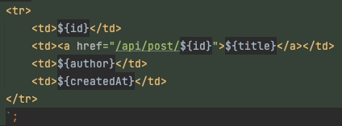

테이블에서 해당글 클릭시 해당글의 번호로 api로 접근해
ModelAndView를 받아서 View를 받아 이동하게된다...


ex)
localhost:8080/api/post/1

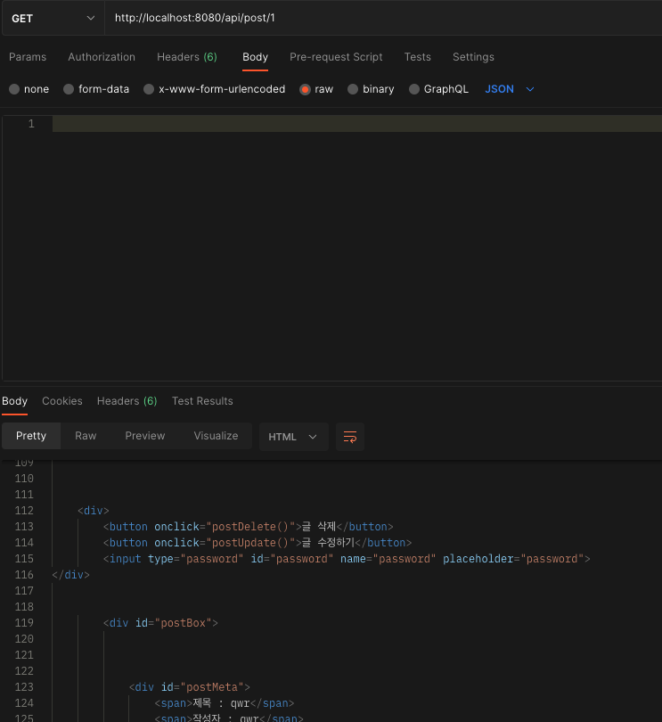

이것을 이제 RESTful스럽게 ,postman사용시 json데이터 형식으로만 받을수 있게 바꿔보려고한다.


아래처럼 ajax를 활용하기위해 온클릭 함수로 바꾸어줬고 href에서 온클릭으로 바꾸니 파란밑줄이 사라졌다..ㅎ
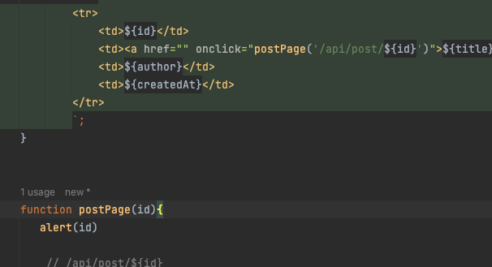

일단 아래처럼 글 클릭시 API호출하는것 까지 확인완료
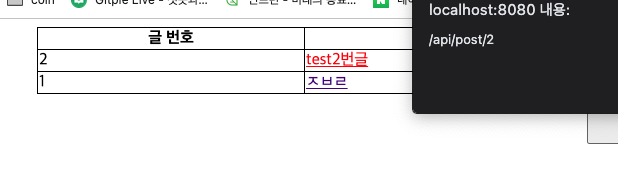


계쏙 하던중 아무리생각해도 컨트롤러단에서는 json만을 리턴하고
페이지를 이동시키면서 json만 받아 처리하는 법을 모르겠어서

그냥 페이지이동없이 javascript로 노가다 했다.


## 렌더링시점

처음엔 글번호 클릭시 postPage()를 호출하고
ajax로 페이지정보를 가저와 아래의 thymleaf로 할려고했는데
에러가 났다.. 아마 데이터가 생기기전 렌더링이먼저되어 그런것같다.

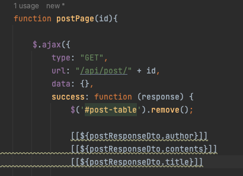

그래서 response 값을 활용해보자라고 생각했고
아래와 같이 하니 동작하였다.
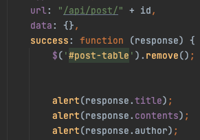


그렇게 해서 아래처럼 한페이지에 다옮겨놓았다

RESTful하게 만들때 모델엔뷰를 쓰지않고 어떻게 뷰를넘기면서 json으로 값을 쓰려면해야할지
생각해볼 부분이다.


삭제와 수정도 원래의 페이지에서 다 가지고왔는데
역시나 아래와 같이 타임리프에서 아직 가지고오지 못한 값들에서 에러가나서
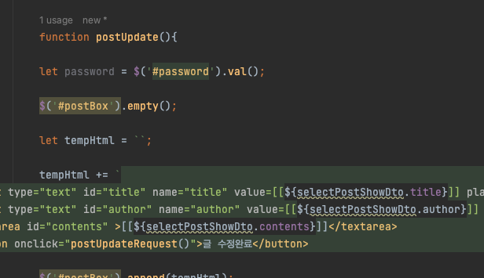


글의 id를 가지고올때 요소들의 온클릭함수에 Id를 넘겨서 해당 Id를 이용했다.
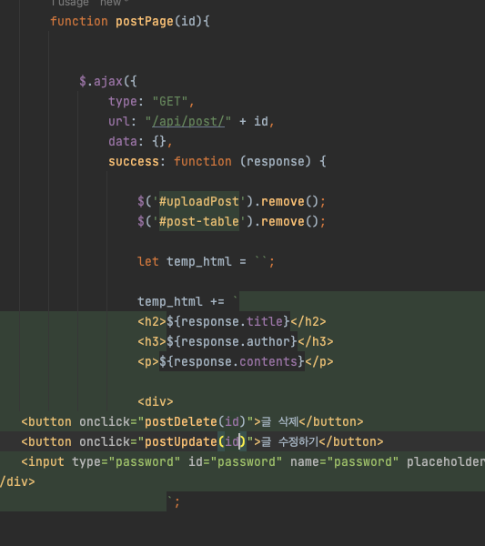