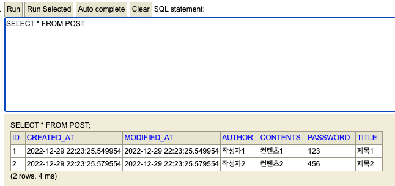

오늘은 10시~12시 주특기 입문 주 차 시험이 있었다.

회원 조회와, 회원 리스트를 RestAPI로 구현하는 과제가 나왔고 아래처럼 구현하였다.  

[깃허브 주소](https://github.com/hyunjunhwang1994/Hanghae99/tree/main/springBasicWeek/Basic_Test)


이것과 관련해서 습관처럼 사용하던 @Transactional 어노테이션을 
굳이 사용하지 않아도 되는 상황이면 사용하지 말라고 하여서 한번 정리해 보았다.

# JPA에서의 트랜잭션이란?

상황에 맞게 사용하기 위해
- Transaction의 이해와
- @Transactional의 이해를 위해 정리를 조금 해보았다.

[참조 블로그](https://kafcamus.tistory.com/30)

일단 저번 TIL에서 더티 체킹이란 것이 일어나서, 레파지토리를 접근하지 않고  
엔티티의 변경을 이용하여 데이터 수정을 한 것이 있었는데

이 더티 체킹은 트랜잭션 안에서의 변경이 일어날 시 변경 내용을 자동으로 데이터베이스에 반영하는 JPA의 특징 중 하나라고 한다.

그렇다면 트랜잭션이란?

데이터베이스 관리 시스템에서 사용되는 용어로,  
데이터를 읽고 쓰고 저장하는 일련의 모든 데이터 연산에 대한 단위라고 한다.

이 단위는 예를 들어 회원정보 수정 기능이 있다면,  
회원정보를 받아 회원정보를 업데이트! 하고, 

회원정보를 다시 select 해서 사용자에게 던져주는 것 까지를 하나의 트랜잭션 단위로 본다고 생각하면 이해하기가 쉬울 것이다.

이런 단위가 필요한 이유?
예를 들어 은행 송금 기능, 주식 기능 등의 경우 자산이 왔다 갔다 하는 중요 서비스이므로

아래는 예만 든 것!
1. A ----송금(5억)-> B 
2. ......로직............
3. DB에 A 사용자의 5억 삭제  
--- 여기서 만약, 3이 실행되고 4가 오기 전에 에러가 난다면? ---  
4. DB에 B 사용자의 5억 추가

A 사용자의 5억은 사라지고 B 사용자는 5억을 받지 못할 것이다.  
그러므로 저것들을 일련의 트랜잭션 단위로 묶고,

1부터 4까지의 단위가 성공하면 모든 과정은 진행이 된 것이고  
중간에 오류가 발생한다면 실행하기 전의 Data 상태로 롤백을 시키는 것이다.


## 그렇다면 트랜잭션을 굳이 사용하지 않아도 되는 경우?
단순하게 생각했을 때 쿼리의 사용이 한번 일어나는 경우일까??  


예를 들어 기존의 코드는 아래처럼 작성했는데  
findById라는 한 번의 쿼리만 실행되고, 값을 못 가지고 온다 쳐도 NullPointerException을 띄워주고,  

못 가지고 온다 해서 금전적으로 손해를 본다든지 중요한 데이터가 날아간다든지 하지 않는다.  

그러므로 @Transactional을 빼줘도 동작할 것이다.

```java
@Transactional(readOnly = true)
    public MemberResponseDto findMember(Long id) {

        Member member = memberRepository.findById(id).orElseThrow(
                () -> new NullPointerException("회원 상세 조회 실패")
        );

        // Entity -> DTO
        MemberResponseDto memberResponseDto = new MemberResponseDto(member);
        return memberResponseDto;
    }
```

```java

    public MemberResponseDto findMember(Long id) {

        Member member = memberRepository.findById(id).orElseThrow(
                () -> new NullPointerException("회원 상세 조회 실패")
        );

        // Entity -> DTO
        MemberResponseDto memberResponseDto = new MemberResponseDto(member);
        return memberResponseDto;
    }
```

트랜잭션과 JPA 관련 부분은 이제 곧 배우니 그때 확실히 정리를 해야겠다.

트랜잭션이 지금 기준으로는, service 계층의 하나의 메소드(로직)에서 돌아가니  
로직 안에서 권한 확인, 정보 수정과 같은 로직이 있다면 사용해야 하지 않을까 싶다!


<hr>


저녁 6시에는 스프링 관련 세션이 있었는데.  
스프링 내에서 데이터를 입력하는 방법을 알려주셔서 간단하게 정리해 보려고 한다.

어떻게 보면 객체를 만들고 넣은 것뿐인데 스프링의 구조에 아직 익숙치 않아서
시도해 보질 못했다.

## SampleApplicationRunner
스프링 부트 어플리케이션 어노테이션이 붙은 Application과 같은 경로의 위치에
SampleApplicationRunner을 만들어주고 아래처럼 컴포넌트 등록한 후 
 
run을 오버라이딩해서 repositroy를 통해 직접적으로 값을 넣어줄 수 있다.  
이제 테스트할 때 아래처럼 미리 만들어놓고 하면 편할 것 같다.

실행 시마다 H2 인 메모리 방식으로, postRepository를 통해 값을 넣어준다.

```java

// SampleApplicationRunner
@Component
@RequiredArgsConstructor
public class SampleApplicationRunner implements ApplicationRunner {

    private final PostRepository postRepository;


    @Override
    public void run(ApplicationArguments args) throws Exception {
        PostRequestDto postRequestDto = new PostRequestDto(
                "제목1", "컨텐츠1", "작성자1", "123"
        );

        PostRequestDto postRequestDto2 = new PostRequestDto(
                "제목2", "컨텐츠2", "작성자2", "456"
        );

        Post post1 = new Post(postRequestDto);
        Post post2 = new Post(postRequestDto2);

        postRepository.save(post1);
        postRepository.save(post2);

    }
}
```




