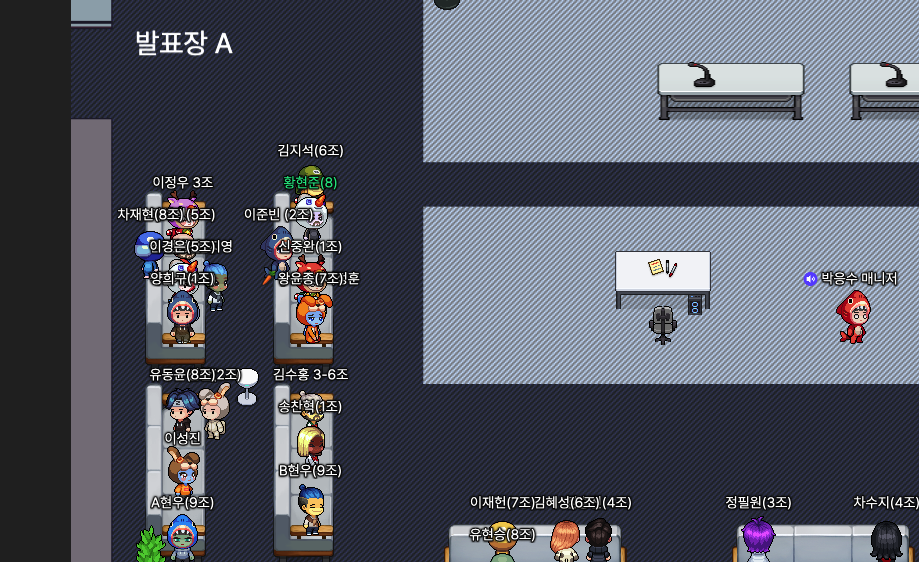

# 주특기 숙련 주 차 발제!
오늘은 스프링 숙련 주 차의 발제가 있었고,
새 원들로 조가 다시 만들어 졌다.

항해99 Spring 숙련주차 라는 강의가 지급되었다.
일단 해당강의의 제목들을 보았을 때

## 이번 주의 목표는?
- CRUD 로직 완벽 익히기
- JPA 이론 파악하기, 잘 다루기
- Auth 인증/인가 다루기
- JWT 사용하기
정도 인 것 같다.

저번 입문 주 차에서는 스프링에관해 전반적인 내용들을 통해 API 만들어 보는 것이 목표였다면  
이제 숙련 주 차에서는 JPA에 대해서 이론적인 내용까지 확실하게 알아가면서  

스프링에 관한 구조를 더 정확히 알아보는것을 목표로 잡고 진행하면 될 것 같다.

숙련 주 차 강의의 1화를 보자마자 스프링 입문 주 차 1화를 봤을 때랑  
똑같이 소리를 하는지 모르겠는 느낌이 왔다... 그래도 입문 주 차 내용이 적응된 것처럼  
이것들도 다음주 쯤이면 적응이되지 않을까 싶다.

JPA 영속성,준영속,비영속,1차캐시, 더티체킹 엔티티 매니저등에 대해서 정리를 해보았다.  
이번주 내내 글 수정해가며 공부 할 예정  
[JPA, EntityManager(Factory)](http://localhost:4000/spring/Spring7/)  
[영속성 컨텍스트, 1차 캐시, Lazy loading, Dirty Checking, 동일성 보장](http://localhost:4000/spring/Spring8/)  
[엔티티 매핑, 연관 관계, 프록시](http://localhost:4000/spring/Spring9/)  

21시에 있었던 특강에서 나온 내용들은 차차 정리해야 겠다.
- softdelete
- testcode의 중요성
- 테스트 커버리지 100%