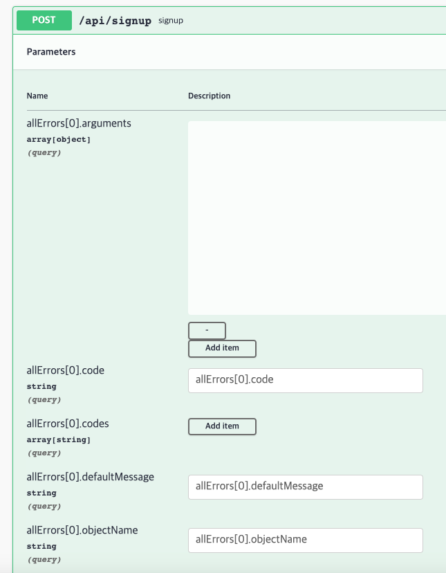
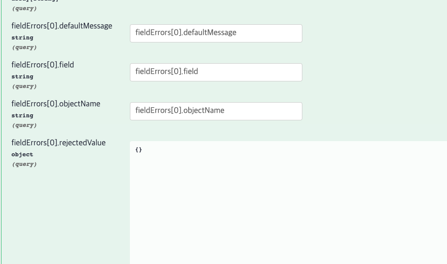
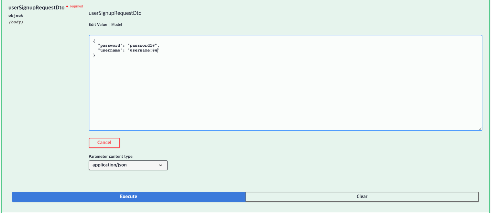
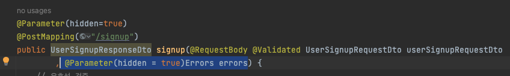
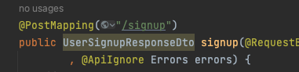
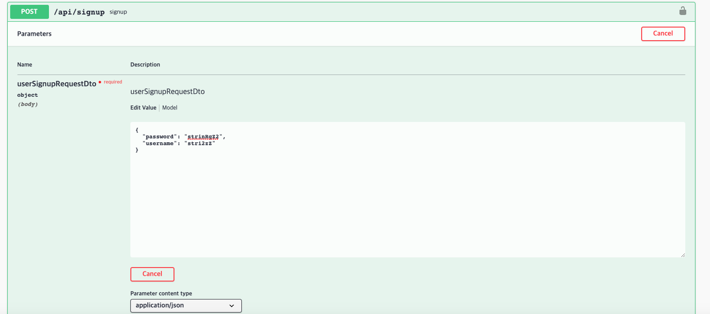

오늘은 토큰 을확인후 글이써진다던지 이런 기능을넣었는데

토큰이 아무리 발급해줘도 null이떠서확인해보니

포스트맨은 자동으로 토큰을 넣어주지 못하여

아래의 블로그를 보고 참조하여 토큰이 자동주입되게 해주었다.

[참조 블로그](https://velog.io/@jejjang/Postman%EC%97%90%EC%84%9C-Token-%EA%B0%92-%EC%A0%80%EC%9E%A5%ED%95%98%EA%B8%B0)

과제완료. 오늘 과제에서 배운것
- JWT토큰 인증/인가 구현 방식
- JPA 연관관계 사용하여 데이터베이스 엮어 사용하기.

# Swagger을 스프링부트에 적용하여 편하게 사용해보았따.

삽질 한거 ..
PostMan으로 매번 하기 귀찮아서
Swagger을 프로젝트에 적용해 보았고,,

적용자체는 어렵지 않았지만, 
JWT토큰을 적용하는 부분에서 생각보다 오래걸렸따.

까먹지 않도록 공부하고 아래의 글에 정리를 했다.

Apikey에서 해맷끼 때문에 APIkey구조와

SwaggerConfig 파일에 
어디는 @EnableSwagger2로 되어있고
나는@EnableWebMvc로만 동작하는데 차이가 무엇일까?

@Validated가 적용된 컨트롤러에 아래와같이 입력이 가능한 이상한 배열들이 나왔다.
사실 그냥

사실그냥 무시하고 아래처럼 입력해도 동작하지만,
왜 이런게 생겼는지 삽질을 좀 해보았다.

생각을 좀ㅎ ㅐ보니 errors  count등이 나오는것보아서
Errors 객체의 문제 인 것 같은데

파라미터를 숨기는 것을 사용해도 동작하지를 않는다.

검색해보니     @Parameter(hidden=true)가 동작하지 않는다는 말들이 있었고
버전의 문제인것같다.

@ApiIgnore로 매개변수 앞에다 사용해주니 이제 잘 동작한다!

# LV2 시작
LV2에 댓글기능이있어서 다시 ERD와 API명세를 정리해보았다.
