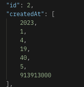
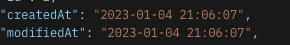
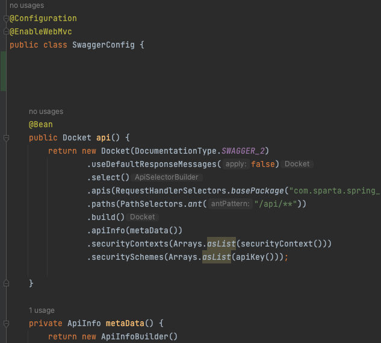
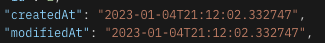

## 현재 상황

- 전체 포스트 + 각 포스트에 속한 댓글 들을 가지고 오는 과정에서
- Infinite recursion(무한 순환 참조)가 일어남.


## 목표
1. 정확히 어느 부분에서 순환 참조가 되는지 알아보자
2. 일단 동작이 가능하게 고쳐보자.
3. 동작이 되면서 더 나은 방법을 찾아보자(뭔가 좋은 방법이 있겠지..?)
4. 이 삽질을 공부하고 정리해 보자


## 해결

### 1. 어느 부분에서 JSON으로 직렬화가 될까? 
처음엔 서비스단에서 문제가 있나 해서 디버깅을 돌려보고 찾아봤지만,
서비스단에서는 단순히 자바 객체지 JSON으로 직렬화를 해주는 부분이 없다.

그래서 많이 찾아봤지만, 순환 참조가 JSON 직렬화 시 나온다는 글만 많고 
정확히 어느 단에서 발생하는지는 많이 안 나와있었다. 하지만 계속 찾아본 결과 아래의 블로그에서  
답을 찾았다.

[참조 블로그](https://pasudo123.tistory.com/350)

<hr>

RestController 어노테이션을 붙인 컨트롤러에서는  
값을 반환(return) 할 때 객체를 JSON 타입으로 ObjectMapper가 변환시켜준다. 

여기서 JSON 타입에 대한 무한 루프 문제가 발생하고 스택오버플로가 뜬다. 

### 2. 일단 빠르게 동작이 되게 해보자.

<hr>

- 일단 처음엔 JSON Ignore를 사용해 해결했지만, 
- JSON Ignore를 사용할 경우 해당 필드를 직렬화에서 제외하므로,
- 해당 필드가 직렬화에 필요할 경우에는 적합하지 않고,
- 지양해야 되는 방법이라 한다.

### 3. 더 나은 방식

<hr>

@JsonManagedReference & @JsonBackReference 방식도 있지만,
더 찾아보니 Entity 대신 DTO로 반환하는 것이 지향해야 할 방식이라 해서 해당 방식으로 해결해 보았다.

### 4. 정리

<hr>

아래의 포스팅에 글을 정리해놨습니다.

[무한 순환 참조 정리 글](https://hyunjunhwang1994.github.io/spring/Spring14/)

<hr>

# EnableWebMvc

## 해결 과정

개인과제를 어느 정도 마무리 해놓고 밤 7시가 되어 보니 
시간 데이터의 형식이 아래처럼 나온다는 걸 처음 봤다.. 으악 야근ㅠ




### 내가 잘못한 게 아니었군?

아래의 포스팅을 보고 아하 LocalDateTime은 원래 저렇게 나오는구나?
[처음 본 글](https://lejewk.github.io/jpa-localdatetime-jsonformat/)

그래서 jsr310이라는 것을 의존성에 넣고.

    implementation 'com.fasterxml.jackson.datatype:jackson-datatype-jsr310'

아래처럼 DTO에 포맷팅을 해주면

    @JsonFormat(shape = JsonFormat.Shape.STRING, pattern = "yyyy-MM-dd HH:mm:ss", timezone = "Asia/Seoul")

시간이 잘 나오는구나?



일단 잘 나오긴 하지만 내가 원했던 형태와 같지가 않다.
 "2022-12-01T12:56:36.821474" 

여기까지 였다면 그렇게 오래 걸리지 않았을 것이다..


### 내가 잘못한 건가..?
팀원이랑 얘기하던 중 특정 사람들은 LocalDateTime이 [] 형식으로 나오고
특정 사람들은 2022-12-01T.... 형식으로 잘 나온다.

또 이런 궁금한 거 있으면 못 참지....

검색을 해보니 @EnableWebMvc를 쓸 경우 타임이 배열로 나온다고 한다.

찾아보니 스웨거 Config 파일에서 해당 어노테이션을 사용하고 있었다.



### 내가 잘못했구나!
그래서 일단 스웨거를 안 쓸 마음은 1도 없지만, 스웨거 관련된 설정들을 전부
지워보고 다시 진행해 봤더니 @JsonFormat으로 포맷팅하지 않아도
원하는 2022-12-01T.... 형식으로 잘 나온다.



하지만 스웨거를 사용하지 못한다..?

이제부터는 영어 공부시간이 온 건가?..!

다행히 한국어 블로그의 첫 힌트를 얻었다.
[첫 힌트](https://velog.io/@godkimchichi/Spring-Boot-json%EC%97%90%EC%84%9C-LocalDateTime%EC%9D%B4-Array%EB%A1%9C-%EB%82%98%EC%98%AC-%EB%95%8C)

음 .. EnableWebMvc가 Json 관련 serializer, deserializer 설정 + 여러 설정을 가지고 있는데
내가 @EnableWebMvc를 써버려서 덮어씌운 거군?


[두 번째 힌트](https://leezzangmin.tistory.com/43)

봐도 잘 모르겠지만. 이 EnableWebMvc와 관련된 녀석을 건드리면 안 되는구나 생각함!


그리고 또 찾아보다가 한 가지 보너스 힌트를 얻었다.

[참조 글](https://johnmarc.tistory.com/52

스프링 부트 2.0부터는 jsr310을 기본 지원한다 하여 다음 의존성을 삭제했다
이 글에서 처음에 이 문제를 해결하려 의존성으로 넣었었는데 휴 한 줄 무 쓸모로 차지할 뻔했네..

    implementation 'com.fasterxml.jackson.datatype:jackson-datatype-jsr310'

그리고, Mvc 모드 활성화 시 왜 Spring Boot의 Auto Configuration이 동작하지 않는지도 나와있다.
@EnableWebMvc를 사용하지 말고 WebMvcConfigurer을 구현하라는데.. 더 쉬운 방법 없을까?


    

그래서 이제부터는 체력 싸움이다.

그래서 아래의 글을 참조해서 위의 개념들이 점점 확실해져 갔고,  
이런 식으로 커스텀을 할 수 있구나 .. 생각했다.
[커스텀 참조 글](http://honeymon.io/tech/2018/03/13/spring-boot-mvc-controller.html)


그리고 역시 해결이 안 날 땐 스택 오버플로우!!

2년 전에 올라온 글임에도 불구하고 나랑 아예 똑같은 상황이었다..

그래서 이 글을 참조하여 Swagger를 사용하면서 기본 json 설정도 같이 사용했다.  
[역시 미제, 본사 뉴욕...](https://stackoverflow.com/questions/64377067/enablewebmvc-showing-date-in-array-formate)


아마 SwaggerConfig은 Swagger대로 가지고 가면서,
WebMvcConfigurer을 구현하여 Jackson Dates Timestamps 설정 관련을 기본값으로 넣어주는 과정인 것 같다.

```java
@Configuration
@EnableWebMvc
public class SwaggerConfig implements WebMvcConfigurer {


    // EnableWebMvc로 인하여 JSON 타입 시간이 배열로 나와서 수동으로 넣어줌
    @Override
    public void extendMessageConverters(List<HttpMessageConverter<?>> converters) {
//        Remove the default MappingJackson2HttpMessageConverter
        converters.removeIf(converter -> {
            String converterName = converter.getClass().getSimpleName();
            return converterName.equals("MappingJackson2HttpMessageConverter");
        });
//        Add your custom MappingJackson2HttpMessageConverter
        MappingJackson2HttpMessageConverter converter = new MappingJackson2HttpMessageConverter();
        ObjectMapper objectMapper = new ObjectMapper();
        objectMapper.registerModule(new JavaTimeModule());
        objectMapper.configure(SerializationFeature.WRITE_DATES_AS_TIMESTAMPS, false);
        converter.setObjectMapper(objectMapper);
        converters.add(converter);
        WebMvcConfigurer.super.extendMessageConverters(converters);
    }

    
    // SwaggerConfig...

```
