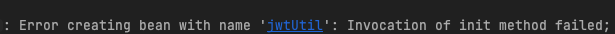
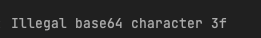

오늘은 스프링 숙련 주 차의 마지막 날.. 시험이 있는 날이다.

시험에서는 JPA의 연관관계에 대해서 나왔고,  
JPA에 대해서 깊게 공부를 안 해서 그런지 생각보다 어려웠다.

그래서 항해 99에서 나온 문제를 재사용하기엔 좀 그래서  
비슷한 예제로 새로 만들어서 아래의 포스팅에 정리를 했다.

[연관관계 맵핑](https://hyunjunhwang1994.github.io/spring/Spring15/)

연관관계 생각해 볼 점 간단 정리
- DB 입장에서는 FK를 가지고 있으면 양방향 조회가 되지만,
- 객체지향 입장에서는 사용할 목적에 따라 단방향, 양방향 맵핑 등을 해주어야 한다.
- @ManyToMany 사용보다는 위의 연관관계 맵핑 글에서처럼 A, C를 관리하는 B 테이블을 직접 만들어  

A <-OneToMany-> B <-ManyToOne-> C  형태로 만들어 주는 것이 좋다.

# 오늘 겪은 문제들.
1. Post 테이블에서 글 삭제 시 삭제되지 않는 것.
2. jwt.secret.key 관련 에러.

## 1. 참조된 데이터 삭제
현재 Post(글)의 PK를 댓글에서 참조(FK) 하고 있는데 이렇게 다른 테이블에 참조되어 있는 경우  
글을 삭제하려고 하면 기본 설정으로는 삭제가 안된다고 한다.
  

해결 방법들
- 로직 상 검증이 끝난 후 참조하고 있는 데이터를 삭제 후
- 목표 데이터를 삭제하거나,
- 상황에 따라 Cascade, OrphanRemoval 등을 사용해 주면 된다.

[Cascade, OrphanRemoval 참조 블로그](https://choiblack.tistory.com/48)

## 2. jwt.secret.key 관련 에러.

위와 같은 에러가 떴다!
jwt.secret.key 값 설정을 

    asdqk@ㄱㄴdqwdkqodk 

대략 위와 같이 하니 떴다.  
테스트를 해보니 한글과 특수문자가 1개라도 들어가 있으면 오류를 뱉었다..

# RestAPI 개인 과제를 RDS 연동 EC2에 호스팅 해보다.

- RDS 연동
- EC2 호스팅
- 도메인네임 연결
- 포트 포워딩

사실상 위의 것들은 정리가 잘 된 블로그도 많고 
AWS라는 공룡기업이 있어서 생각보다 어렵지 않았다.

## 어려웠던 점

1. 기존 스프링 부트의 인 메모리 방식 h2에서 RDS의 MySQL을 사용할 시
자잘한 설정으로 인해 오류가 나는 부분들이 있어서 까다로웠음.

2. JPA를 사용함에 있어서 연관관계를 짜고, 설계를 하는 것들이 생각보다 어려웠다.
그리고 공부를 하던 도중 연관관계 편의 메서드라는 것을 보았는데

어느 정도 개인과제를 완성시키고 순환 참조라는 문제도 해결하고 난 후였기에,
이게 왜 필요한 거지?라는 생각이 들었고 아래 포스팅에 정리해 보았다.

[정리 글](https://hyunjunhwang1994.github.io/spring/Spring16/)

> 여러 장점이 있지만, 결국 객체지향 관점적인 부분에서 양방향으로 다루기 위해 필요한 것이구나라고 결론을 내렸습니다!

