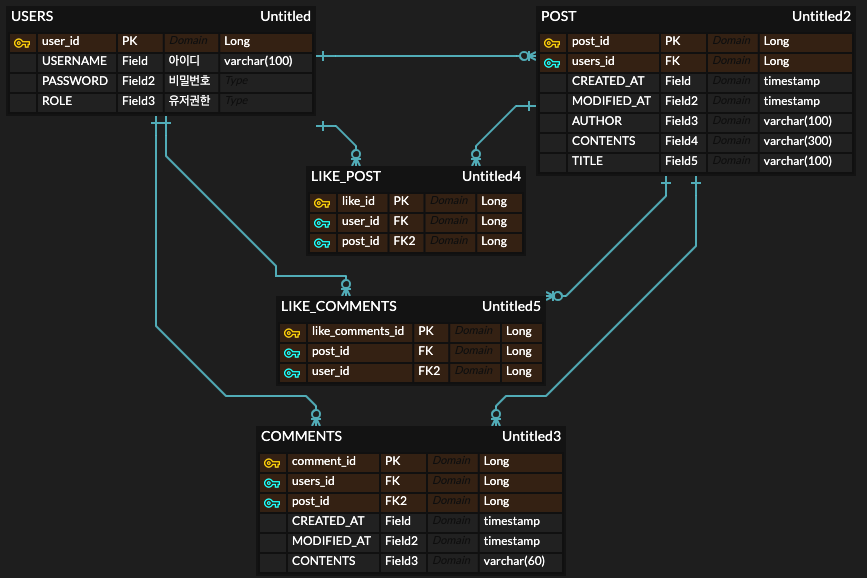

# 오늘 공부한 것
- Test
- AOP
- Exception
- Transaction

# 개인과제 시작

개인과제는 저번 숙련 주 차의 과제에 여러가지 새로운 요구사항을 추가하는 문제로 나왔다.

새로운 요구사항
- 스프링 시큐리티 적용하기.
- 게시글 좋아요 API 추가하기.
- 댓글 좋아요 API 추가하기.

기본 적인 요구 사항은 위와 같고 일단 아래처럼 ERD를 수정해 보았다.
저번 과제와 비교했을 때 추가된 것은
게시글의 좋아요와, 댓글의 좋아요를 담을

LIKE_POST, LIKE_COMMENTS   테이블 2개이다.

## 시작 전 정리

- API, Swagger UI 로그인 안할 시 사용 못하게 -> 로그인, 회원가입 페이지
- 로그인 시 API 요청이나, Swagger UI 진입 가능
- 인증 필요없는 것 H2Console

# 헤메었떤 부분
Spring Security 사용중, CustomFilter를 만드는 과정에서

프론트단에서 아이디, 비밀번호가 넘어오면, 필터단에서 검증을 한뒤 진행되는데,

현재 REST API를 하고 있기에, JSON 타입으로 프론트에서 -> 백으로 넘겼더니

인식을 못해 한참동안 해보다 찾아보니 JSON타입으로 는 받지 못한다 한다.

[참고 블로그](https://johnmarc.tistory.com/74)

그래서 생각해 보았다..

- 현재 만들고 있는건 Rest API?
- 스프링 시큐리티의 form login을 쓰려하니
- 이름 자체 부터가 form login이다..
- 그럼 Spring security의 로그인을 Rest API에 맞게
- json데이터로 받아서 처리하려면 어떡해야하지?